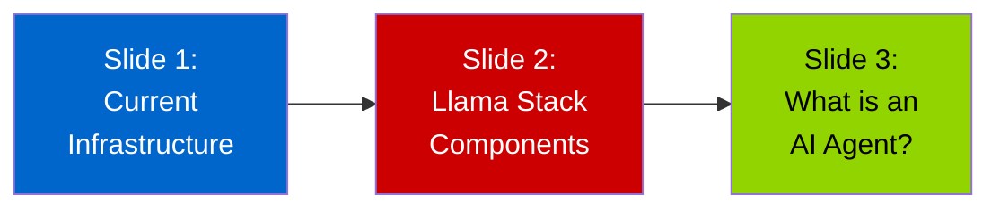
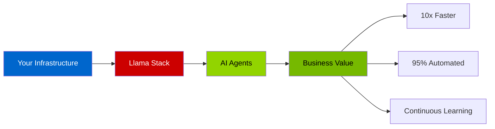

# Executive Presentation: x2Ansible with AI Agents
## For Senior Management

---

## 🎯 Presentation Overview

This is a **management-focused** presentation that explains the x2Ansible solution and AI agent technology in business terms. Designed for executives and senior managers who need to understand capabilities, value, and strategic implications without deep technical details.

---

## 📑 Slide Structure

**Total Duration:** ~35-40 minutes + 10-15 minutes Q&A

---

## 📊 Slide-by-Slide Guide

### [Slide 1: Your Current Infrastructure](./executive-slide-01-current-infrastructure.md)
**Duration:** ~12-15 minutes

**Key Messages:**
- You've already invested in enterprise AI infrastructure
- OpenShift + ACM + OpenShift AI 3 + GPUs
- NVIDIA L40s and A100s capabilities
- Significant unused capacity available
- No data leaves your environment

**Talking Points:**
- "You have OpenShift AI 3 with Llama Stack framework"
- "Your NVIDIA L40s are perfect for production inference workloads"
- "Your A100s can run the largest models available"
- "This infrastructure is enterprise-grade and fully supported by Red Hat"
- "You're ready to deploy AI applications today"

**Questions to Expect:**
- *"How much did we spend on this?"* → Emphasize it's already deployed
- *"Are we using it fully?"* → Show the capacity utilization chart
- *"Is this secure?"* → 100% on-premises, zero external dependencies

---

### [Slide 2: Understanding Llama Stack](./executive-slide-02-llama-stack-components.md)
**Duration:** ~12-15 minutes

**Key Messages:**
- Llama Stack = 3 core components working together
- **Inference Engine** - runs AI models on your GPUs
- **Vector Database** - stores organizational knowledge
- **Agent Framework** - enables intelligent automation
- Each component serves a distinct business purpose

**Talking Points:**
- "Think of Llama Stack as the operating system for AI applications"
- "Inference Engine turns your GPUs into usable AI capability"
- "Vector Database makes AI understand YOUR organization's patterns"
- "Agent Framework enables AI to work autonomously"
- "Together, these components enable 10x productivity improvements"

**Visual Focus:**
- The component table is key - walk through each row
- The "How Components Work Together" diagram shows the system in action
- Business use cases table connects technology to value

**Questions to Expect:**
- *"What's the difference from ChatGPT?"* → Your data, your infrastructure, learns your patterns
- *"Can we use this for other things besides Chef migration?"* → Yes! Many use cases
- *"How does the Vector Database work?"* → Use the RAG example with/without comparison

---

### [Slide 3: What is an AI Agent?](./executive-slide-03-what-is-an-agent.md)
**Duration:** ~12-15 minutes

**Key Messages:**
- AI Agents are "intelligent workers" not just "automated scripts"
- They can plan, use tools, remember context, and adapt
- Traditional automation: 80% automated / 20% manual
- With AI Agents: 95% automated / 5% manual
- Agents combine LLM "brains" with tool "hands"

**Talking Points:**
- "Traditional software follows recipes; agents solve problems"
- "An agent can figure out HOW to achieve a goal, not just execute steps"
- "Agents learn and improve with each task"
- "Multi-agent systems let specialists collaborate like a team"
- "We maintain control through guardrails and audit trails"

**Visual Focus:**
- **Most important:** The sequence diagram showing agent loop
- The "Traditional vs Agent" comparison
- The Chef-to-Ansible real-world example
- The multi-agent architecture

**Questions to Expect:**
- *"Is this safe? Can it do damage?"* → Walk through the safety & control section
- *"What if it makes mistakes?"* → Validation steps, human approval for critical actions
- *"How long to see ROI?"* → 2-3 hours vs 2-3 days per cookbook, show math
- *"Do we need to hire AI experts?"* → No, agents provide the expertise

---

## 🎨 Presentation Tips

### Delivery Strategy

**Slide 1 - Build Confidence**
- Start by validating their investment
- "You already have everything you need"
- Use specific numbers (L40s: 48GB, A100s: 80GB)
- Show the capacity chart - headroom for growth

**Slide 2 - Build Understanding**
- Use analogies: "Operating system for AI"
- Focus on the 3-component table
- Connect each component to business value
- Keep it at the conceptual level

**Slide 3 - Build Excitement**
- This is where it gets real
- Use the Chef→Ansible example heavily
- Show the 80/20 vs 95/5 diagram
- Talk ROI: time savings, quality improvements

### Pacing

```mermaid
gantt
    title 45-Minute Presentation Flow
    dateFormat mm
    axisFormat %M min
    
    section Slides
    Slide 1 Infrastructure    :s1, 00, 12m
    Slide 2 Llama Stack       :s2, 12, 12m
    Slide 3 AI Agents         :s3, 24, 15m
    
    section Interaction
    Q&A Throughout            :qa, 00, 39m
    Final Q&A                 :fqa, 39, 6m
```

**Don't rush Slide 3** - this is where the "aha" moment happens.

---

## 🎯 Key Concepts to Emphasize

### The "Rule of 3s"

**Infrastructure (Slide 1):**
1. OpenShift + ACM + OpenShift AI
2. L40s (production) + A100s (performance)
3. Secure + Scalable + Supported

**Llama Stack (Slide 2):**
1. Inference Engine (GPU brain power)
2. Vector Database (organizational knowledge)
3. Agent Framework (intelligent automation)

**AI Agents (Slide 3):**
1. Plan (figure out approach)
2. Act (use tools)
3. Learn (improve over time)

### The Value Proposition

**Always connect back to:**
- ✅ Speed: 2-3 hours vs 2-3 days
- ✅ Quality: 95%+ accuracy
- ✅ Scale: Unlimited usage, fixed cost
- ✅ Learning: Gets better with each migration

---

## 📋 Executive Summary (If Time Is Short)

If you only have 15-20 minutes, use this approach:

### Fast Track Version

**5 minutes - Slide 1:**
- "You have OpenShift AI 3 with Llama Stack and NVIDIA GPUs"
- Show the infrastructure diagram only
- "This is enterprise AI, on-premises, ready to use"

**5 minutes - Slide 2:**
- "Llama Stack has 3 parts: Inference, Vector DB, Agents"
- Show the component table only
- "Together they enable intelligent automation"

**8 minutes - Slide 3:**
- "AI Agents can plan, act, and learn autonomously"
- Show the sequence diagram
- Show the 80/20 vs 95/5 comparison
- "Chef→Ansible migration: 2-3 hours instead of 2-3 days"

**2 minutes - Close:**
- "You have the infrastructure, we have the use case"
- "x2Ansible migration is the perfect first application"
- "Expected ROI within first 10 cookbooks"

---

## 🎤 Opening & Closing

### Opening (30 seconds)

> "Today I'm going to show you three things: First, the AI infrastructure you've already invested in and how powerful it is. Second, what Llama Stack provides and why it matters. Third, what AI agents are and how they'll transform automation work. By the end, you'll understand how we can use this technology to solve real business problems, starting with Chef to Ansible migration."

### Closing (1 minute)

> "Let me summarize: You have enterprise-grade AI infrastructure with OpenShift AI 3 and NVIDIA GPUs. Llama Stack provides three critical capabilities - inference, knowledge, and agents. AI agents can automate 95% of work that previously required expensive experts. The x2Ansible migration project is our opportunity to put this infrastructure to work and demonstrate ROI. We're estimating 10x productivity improvement and payback within the first quarter."

---

## ❓ Anticipated Questions & Answers

### Infrastructure Questions

**Q: "How much spare capacity do we have?"**
A: Show the capacity chart from Slide 1. "Based on current allocation, we have approximately 70% available capacity for new AI applications."

**Q: "What else can we use this for?"**
A: "Many use cases: intelligent chatbots, code generation, log analysis, documentation automation, incident response. Chef migration is our pilot, but the platform supports dozens of applications."

**Q: "Is our data secure?"**
A: "100% on-premises. No data leaves your datacenter. No external API calls. Full audit logging. Red Hat enterprise security throughout."

### Technology Questions

**Q: "How is this different from RPA (Robotic Process Automation)?"**
A: "RPA follows scripts - brittle and breaks easily. AI agents reason and adapt - they handle exceptions and learn. RPA is like a recording; agents are like smart assistants."

**Q: "What if the AI makes mistakes?"**
A: "Multiple safety layers: validation tools (ansible-lint), human review steps for critical actions, audit trails, rollback capability, and sandboxed execution. Plus, agents can explain their reasoning for transparency."

**Q: "Do we need data scientists?"**
A: "No. Llama Stack abstracts the complexity. Your operations team can build and deploy agents using tools like x2Ansible. The AI provides the expertise."

### Business Questions

**Q: "What's the ROI?"**
A: "For Chef migration specifically: 2-3 hours vs 2-3 days per cookbook = 10x productivity. If you have 100 cookbooks, that's 200+ engineering days saved. At loaded cost, that's $300K+ in first year."

**Q: "How long to production?"**
A: "Infrastructure is ready today. Deploy x2Ansible in 2 weeks. 2-week pilot with 5 cookbooks. Scale to production in 60 days total."

**Q: "What's the risk?"**
A: "Low. Infrastructure is proven Red Hat technology. x2Ansible is purpose-built. We start with pilot to validate. Worst case: we learn and adjust. Best case: 10x productivity improvement."

### Strategy Questions

**Q: "Should we build or buy AI solutions?"**
A: "You've already bought the platform (OpenShift AI). Now we're building applications on it using open-source frameworks (Llama Stack). This gives you flexibility without vendor lock-in."

**Q: "What's our AI strategy going forward?"**
A: "Start with high-value, well-defined use cases like Chef migration. Build expertise. Expand to adjacent automation problems. Eventually, AI-augmented operations across the board."

**Q: "How does this compare to GitHub Copilot / ChatGPT Enterprise?"**
A: "Those are general-purpose tools for individual developers. This is custom AI applications for your specific workflows, using your data, on your infrastructure. Complementary, not competitive."

---

## 📊 Success Metrics

After this presentation, executives should be able to:

- ✅ Explain in one sentence what Llama Stack is
- ✅ Describe the difference between traditional automation and AI agents
- ✅ Articulate the business value of the x2Ansible project
- ✅ Understand that the infrastructure investment is already made
- ✅ Make a go/no-go decision on the pilot project

---

## 🔗 Follow-Up Materials

**Leave behind:**
1. Executive summary (1-pager)
2. ROI calculator (spreadsheet showing cookbook conversion math)
3. Pilot project proposal (timeline, resources, deliverables)
4. Technical deep-dive deck (for their technical teams)

**Offer:**
- Live demo of x2Ansible UI (if ready)
- Architecture review session with their platform team
- Red Hat engagement for deployment support

---

## 📝 Customization Checklist

Before presenting, customize:

- [ ] Update GPU counts (L40s, A100s) to match actual inventory
- [ ] Update cluster configuration details
- [ ] Add specific internal project names if applicable
- [ ] Include actual cost numbers if approved to share
- [ ] Add executive sponsor names
- [ ] Include org chart placement (where does this team sit?)
- [ ] Reference any related initiatives (cloud strategy, automation CoE, etc.)

---

## 🎯 Call to Action

**At the end, ask for:**

1. **Approval for pilot project** (2 weeks, 5 cookbooks, 2 engineers)
2. **Executive sponsor** (director-level or above)
3. **Follow-up meeting** (dive deeper with technical teams)
4. **Access to resources** (GPU allocation, engineering time)

**Be specific:**
> "We're requesting approval for a 2-week pilot starting [date]. We'll convert 5 representative cookbooks to demonstrate the technology and measure productivity gains. We need [Engineer A] and [Engineer B] allocated 50% time, plus access to 2 L40s GPUs. At the end of 2 weeks, we'll present results and recommend whether to proceed to full-scale migration. May we have your approval to proceed?"

---

## 💡 Key Takeaway

**For Management:**

> "You've invested in enterprise AI infrastructure. Llama Stack provides the framework. AI agents provide the intelligence. x2Ansible is how we put it all together to solve real business problems. Let's start with Chef migration and demonstrate the value."

---

**Presentation Style:** Professional, business-focused, ROI-oriented  
**Audience Level:** Senior management, non-technical executives  
**Objective:** Secure approval for x2Ansible pilot project

Good luck! 🚀

