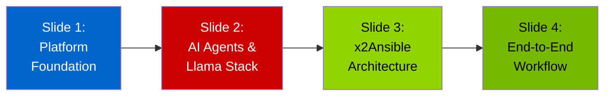

# x2Ansible Migration Presentation
## Chef → Ansible with Red Hat AI 3 on OpenShift

---

## 📑 Presentation Structure

This presentation consists of **4 slides** designed for a technical audience without extensive AI experience. Each slide builds on the previous one to tell the complete story of the x2Ansible solution.

### 🎯 Presentation Flow



---

## 📊 Slide Overview

### [Slide 1: Platform Foundation](./slide-01-platform-foundation.md)
**Duration**: ~10 minutes  
**Key Topics**:
- The business challenge: Chef → Ansible migration
- Your platform stack: OpenShift + Red Hat AI 3
- Llama Stack as the AI foundation
- Deployment architecture overview

**Audience Takeaway**: "We already have the infrastructure needed"

---

### [Slide 2: Understanding AI Agents & Llama Stack](./slide-02-ai-agents-and-llama-stack.md)
**Duration**: ~15 minutes  
**Key Topics**:
- What is an AI Agent? (Traditional vs AI)
- Complete Llama Stack component breakdown
- Agent Framework, Tools API, Memory Service
- RAG (Retrieval-Augmented Generation) explained
- vLLM and GPU acceleration

**Audience Takeaway**: "Now I understand how AI agents work and what makes them intelligent"

---

### [Slide 3: The x2Ansible Solution](./slide-03-x2ansible-architecture.md)
**Duration**: ~12 minutes  
**Key Topics**:
- Three-tier architecture (UI, API, Intelligence)
- x2a-ui features and components
- x2a-api architecture and endpoints
- Agent integration patterns
- Security and error handling
- Model Context Protocol (MCP)

**Audience Takeaway**: "This is how the UI and API work together with AI"

**References**:
- [x2a-ui on GitHub](https://github.com/x2ansible/x2a-ui)
- [x2a-api on GitHub](https://github.com/x2ansible/x2a-api)

---

### [Slide 4: End-to-End Workflow](./slide-04-end-to-end-workflow.md)
**Duration**: ~18 minutes  
**Key Topics**:
- Complete 5-phase migration journey
- Detailed sequence diagrams
- Conversational AI workflow
- RAG-enhanced knowledge retrieval
- Multi-agent collaboration
- Learning and improvement loop
- Production deployment topology
- Success metrics and business value

**Audience Takeaway**: "I can visualize the complete process and the value it delivers"

---

## 🎨 Presentation Tips

### Visual Elements
- All slides contain **extensive Mermaid diagrams**
- Color coding is consistent:
  - 🔴 **Red** (#cc0000): Red Hat AI / Agent components
  - 🔵 **Blue** (#0066cc): UI / API application layer
  - 🟢 **Green** (#92d400): Integration / Automation layer
  - 🟠 **Orange** (#ff9900): Validation / Quality layer

### Delivery Recommendations

1. **Slide 1** (10 min)
   - Start with the business problem
   - Emphasize "you already have this"
   - Keep technical depth moderate

2. **Slide 2** (15 min)
   - **Most important for AI education**
   - Take time on "What is an AI Agent?"
   - Use real-world analogies
   - The Llama Stack diagram is dense - walk through each layer
   - RAG section needs clear explanation

3. **Slide 3** (12 min)
   - Reference the actual GitHub repos
   - Show code structure if possible
   - Emphasize API-first design
   - MCP section is advanced - gauge audience interest

4. **Slide 4** (18 min)
   - Bring it all together
   - The sequence diagram is the "money shot"
   - Emphasize the learning loop
   - End with business value and next steps

### Audience Interaction Points

- **After Slide 1**: "Do you have questions about your current OpenShift setup?"
- **During Slide 2**: "Think of an AI agent like a smart assistant that can use tools..."
- **After Slide 3**: "Would you like to see a live demo of the UI?"
- **During Slide 4**: "Imagine one of your cookbooks going through this process..."

---

## 🛠️ Technical Setup for Presentation

### Viewing the Slides

**Option 1: Markdown Viewer**
- Use VS Code with Markdown Preview Enhanced extension
- Mermaid diagrams render automatically

**Option 2: Convert to HTML**
```bash
# Using markdown-it with mermaid plugin
npm install -g markdown-it markdown-it-mermaid
markdown-it slide-01-platform-foundation.md -o slide-01.html
```

**Option 3: Reveal.js Presentation**
- Convert to reveal.js format for interactive presentation
- Supports speaker notes and transitions

**Option 4: GitHub/GitLab**
- Push to GitHub - Mermaid renders natively
- Share links for remote viewing

### Demo Environment Preparation

If planning live demo:
1. ✅ Ensure x2a-ui is accessible
2. ✅ Have sample Chef cookbook ready
3. ✅ Pre-populate one conversion in progress
4. ✅ Test network connectivity to cluster
5. ✅ Prepare fallback screenshots

---

## 📋 Quick Reference Card

### Key Technologies Mentioned

| Technology | Purpose | Slide |
|------------|---------|-------|
| **OpenShift 4.x** | Container platform | 1 |
| **Red Hat AI 3** | AI platform with Llama Stack | 1, 2 |
| **Llama Stack** | AI agent framework | 2 |
| **vLLM** | GPU inference engine | 2 |
| **Vector Database** | RAG knowledge storage | 2 |
| **x2a-ui** | Next.js frontend | 3 |
| **x2a-api** | FastAPI backend | 3 |
| **MCP** | Model Context Protocol | 3 |
| **AAP** | Ansible Automation Platform | 1, 4 |

### Key Concepts Explained

| Concept | Simple Definition | Where |
|---------|------------------|-------|
| **AI Agent** | Software that reasons, plans, uses tools, and learns | Slide 2 |
| **RAG** | Giving AI access to specific documents to answer questions | Slide 2 |
| **Embedding** | Converting text to numbers for similarity search | Slide 2 |
| **Vector DB** | Database that finds similar items quickly | Slide 2 |
| **Streaming** | Showing results in real-time as they're generated | Slide 3 |
| **MCP** | Standard way for AI to use external tools | Slide 3 |
| **Session Memory** | AI remembers what you talked about | Slide 2 |
| **Multi-Agent** | Multiple AI specialists working together | Slide 4 |

---

## 🎯 Success Criteria

After this presentation, the audience should be able to:

- ✅ Explain what an AI agent is in their own words
- ✅ Understand the role of each Llama Stack component
- ✅ Describe the x2Ansible architecture at a high level
- ✅ Visualize the end-to-end migration workflow
- ✅ Articulate the business value
- ✅ Know what questions to ask for their specific use case

---

## 🔗 Additional Resources

### Source Code
- **x2a-ui**: https://github.com/x2ansible/x2a-ui
- **x2a-api**: https://github.com/x2ansible/x2a-api

### Documentation
- **Red Hat OpenShift AI**: https://www.redhat.com/en/technologies/cloud-computing/openshift/openshift-ai
- **Llama Stack GitHub**: https://github.com/meta-llama/llama-stack
- **Ansible Best Practices**: https://docs.ansible.com/ansible/latest/user_guide/playbooks_best_practices.html

### Related Topics
- Model Context Protocol (MCP)
- Retrieval-Augmented Generation (RAG)
- GPU-accelerated inference with vLLM
- Vector databases and embeddings

---

## 📝 Customization Notes

### For Your Environment
Before presenting, update:
- [ ] GPU types (A100, H100, etc.) to match your hardware
- [ ] OpenShift version to match your cluster
- [ ] Storage backend (NFS, Ceph, etc.)
- [ ] Any organization-specific security requirements
- [ ] Internal Git repository URLs

### For Your Audience
Adjust based on audience:
- **Executive**: Focus on Slides 1 & 4, business value
- **Operations**: Emphasize Slides 1 & 4, deployment topology
- **Developers**: Deep dive on Slides 2 & 3, architecture
- **Architects**: All slides, with emphasis on integration patterns

---

## 🤝 Q&A Preparation

### Expected Questions

**"How long does a typical conversion take?"**
→ Point to Slide 4 success metrics: 2-3 hours vs 2-3 days manual

**"What if the AI makes mistakes?"**
→ Reference Slide 4 validation phase: human review + ansible-lint

**"How is this different from ChatGPT?"**
→ Slide 2: on-premises, uses your data, learns your patterns

**"What about security/data privacy?"**
→ Slide 1: 100% on-cluster, no external API calls

**"Can it handle complex cookbooks?"**
→ Slide 4: multi-agent collaboration for complex scenarios

**"How much does this cost?"**
→ Uses existing OpenShift + Red Hat AI subscription, no per-use fees

---

## 📧 Follow-Up Materials

After the presentation, share:
1. These markdown files
2. Link to x2ansible GitHub org
3. Sample cookbook conversion (if available)
4. Red Hat AI 3 documentation
5. Contact information for deeper technical discussion

---

**Total Presentation Time**: ~55 minutes + 15 minutes Q&A = **70 minutes**

Good luck with your presentation! 🚀

