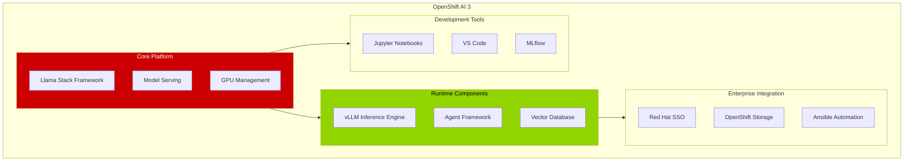
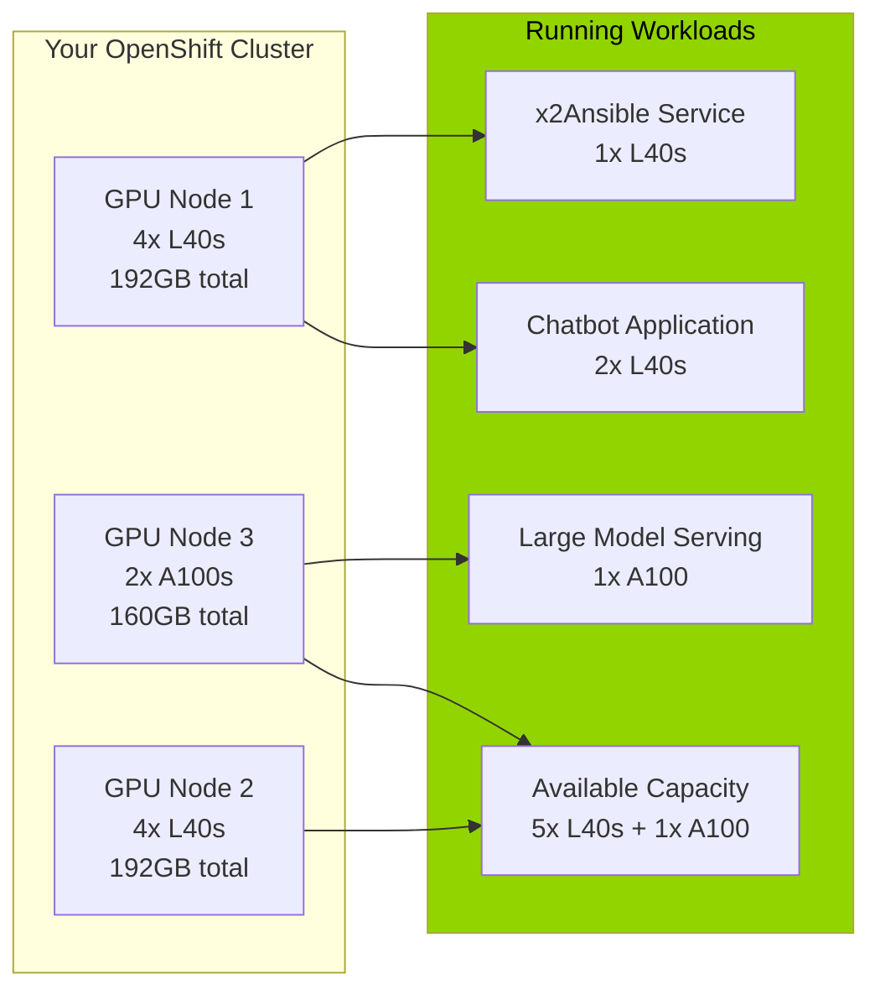
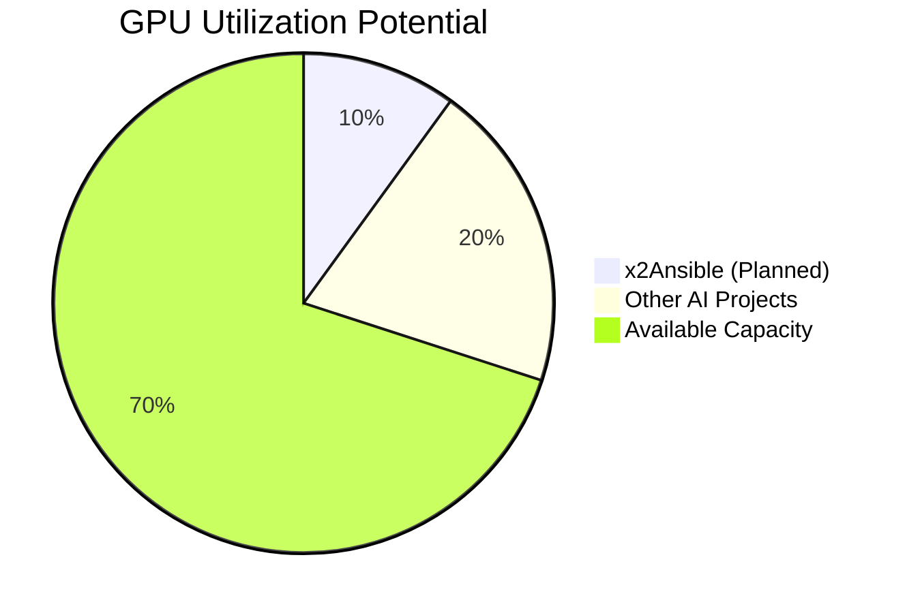

# Executive Slide 1: Your Current AI Infrastructure
## What You Already Have in Place

---

## 🏢 Your Investment: Enterprise AI Platform

You have already deployed a complete, enterprise-grade AI infrastructure. Here's what's in your environment:

---

## 📊 Current Infrastructure Inventory

```mermaid
graph TB
    subgraph Platform[Your OpenShift Environment]
        subgraph Management[Advanced Cluster Management - ACM]
            ACM1[Multi-Cluster Management]
            ACM2[Policy Enforcement]
            ACM3[Application Lifecycle]
        end
        
        subgraph Compute[OpenShift Container Platform]
            OCP1[Production Clusters]
            OCP2[High Availability]
            OCP3[Enterprise Support]
        end
        
        subgraph AI[OpenShift AI 3]
            OSAI1[Llama Stack Runtime]
            OSAI2[Model Serving Platform]
            OSAI3[Data Science Tools]
        end
        
        subgraph Hardware[GPU Compute Resources]
            GPU1[NVIDIA L40s<br/>48GB VRAM<br/>Cost-effective inference]
            GPU2[NVIDIA A100s<br/>80GB VRAM<br/>High-performance training]
        end
    end
    
    Management --> Compute
    Compute --> AI
    AI --> Hardware
    
    style Management fill:#0066cc,color:#fff
    style Compute fill:#cc0000,color:#fff
    style AI fill:#92d400,color:#000
    style Hardware fill:#76b900,color:#000
```

---

## 📋 Platform Components Summary

| Component | What It Is | What It Provides | Business Value |
|-----------|------------|------------------|----------------|
| **Advanced Cluster Management (ACM)** | Multi-cluster orchestration | • Manage multiple OpenShift clusters • Enforce security policies • Deploy applications consistently | **Centralized control** across your infrastructure |
| **OpenShift Container Platform** | Enterprise Kubernetes | • Container orchestration • Application hosting • Developer platform | **Reliable foundation** for all workloads |
| **OpenShift AI 3** | AI/ML platform | • **Llama Stack** framework • Model deployment • GPU management | **AI capabilities** on your infrastructure |
| **NVIDIA L40s** | Mid-range GPUs | • 48GB memory per GPU • Efficient inference • Cost-optimized | **Production AI** at scale |
| **NVIDIA A100s** | High-end GPUs | • 80GB memory per GPU • Maximum performance • Training + inference | **Premium AI** for demanding workloads |

---

## 💰 What This Represents

### Current Capabilities

**You Can:**
- ✅ Run large language models (LLMs) on your own hardware
- ✅ Process sensitive data without external cloud dependencies
- ✅ Scale AI workloads across multiple GPUs
- ✅ Manage everything from a single control plane
- ✅ Enforce consistent policies across all clusters

**You Don't Need:**
- ❌ External AI APIs (like OpenAI, Anthropic)
- ❌ Public cloud GPU instances
- ❌ Multiple vendor tools
- ❌ Data egress to third parties

---

## 🎯 GPU Resource Breakdown

### NVIDIA L40s - Production Workhorse

| Specification | Value | Best For |
|--------------|-------|----------|
| **Memory** | 48GB VRAM | Medium-large models (up to 30B parameters) |
| **Performance** | ~2x faster than previous gen | Real-time inference at scale |
| **Cost** | ~$10k per GPU | Cost-effective production deployment |
| **Use Case** | **Inference-optimized** | Serving models to applications |

**Perfect for:** Running the x2Ansible conversion service, chatbots, real-time recommendations

---

### NVIDIA A100s - Performance Leader

| Specification | Value | Best For |
|--------------|-------|----------|
| **Memory** | 80GB VRAM | Large models (up to 70B+ parameters) |
| **Performance** | Industry-leading throughput | Complex AI workloads |
| **Cost** | ~$15-20k per GPU | Premium performance |
| **Use Case** | **Training + Inference** | Large-scale model serving, fine-tuning |

**Perfect for:** Running Llama 3 70B, training custom models, high-demand inference

---

## 🔍 OpenShift AI 3: The AI Engine

**What OpenShift AI 3 Adds:**
- 🧠 **Llama Stack** - Complete AI agent framework (more on next slide)
- 🚀 **vLLM** - Fast GPU inference engine
- 📊 **Data Science Tools** - Notebooks, experiment tracking
- 🔐 **Enterprise Security** - SSO, RBAC, audit logging
- 🔌 **Native Integration** - Works seamlessly with OpenShift ecosystem

---

## 📈 Scale & Capacity

### Current GPU Capacity Example

**Scalability:**
- Can run **multiple AI applications** simultaneously
- **Isolated workloads** - one application doesn't affect others
- **Dynamic allocation** - GPUs assigned as needed
- **High availability** - workloads can move between nodes

---

## 💡 Bottom Line for Management

### What This Infrastructure Enables

| Capability | Business Impact |
|------------|----------------|
| **On-Premises AI** | No data leaves your datacenter - full control |
| **Cost Predictable** | No per-API-call charges - fixed GPU costs |
| **Scalable** | Add GPUs as demand grows |
| **Integrated** | Works with existing OpenShift investments |
| **Secure** | Enterprise-grade security and compliance |
| **Supported** | Red Hat enterprise support included |

### Investment Status

**You have significant headroom** to deploy additional AI-powered applications on this infrastructure.

---

## 🎯 Key Takeaway

> **You've already made the infrastructure investment. Now it's about putting it to work.**

**Your platform provides:**
- ✅ Enterprise AI runtime (OpenShift AI 3 with Llama Stack)
- ✅ High-performance compute (NVIDIA GPUs)
- ✅ Centralized management (ACM)
- ✅ Security and compliance
- ✅ Room to grow

**Next:** Understanding what Llama Stack provides and how AI agents work

---

