# Executive Slide 1: AI Infrastructure Foundation
## High-Level Platform Requirements

---

## 🏢 Enterprise AI Platform Components

This solution requires an enterprise-grade AI infrastructure. Here are the platform components needed:

---

## 📊 Infrastructure Components Overview

---

## 📋 Platform Components Summary

| Component | What It Is | What It Provides | Business Value |
|-----------|------------|------------------|----------------|
| **Advanced Cluster Management (ACM)** | Multi-cluster orchestration | • Manage multiple OpenShift clusters • Enforce security policies • Deploy applications consistently | **Centralized control** across infrastructure |
| **OpenShift Container Platform** | Enterprise Kubernetes | • Container orchestration • Application hosting • Developer platform | **Reliable foundation** for all workloads |
| **OpenShift AI 3** | AI/ML platform | • **Llama Stack** framework • Model deployment • GPU management | **AI capabilities** on infrastructure |
| **NVIDIA L40s** | Mid-range GPUs | • 48GB memory per GPU • Efficient inference • Cost-optimized | **Production AI** at scale |
| **NVIDIA A100s** | High-end GPUs | • 80GB memory per GPU • Maximum performance • Training + inference | **Premium AI** for demanding workloads |

---

## 💰 What This Platform Provides

### Platform Capabilities

**Platform Enables:**
- ✅ Run large language models (LLMs) on dedicated hardware
- ✅ Process sensitive data without external cloud dependencies
- ✅ Scale AI workloads across multiple GPUs
- ✅ Manage everything from a single control plane
- ✅ Enforce consistent policies across all clusters

**Not Required:**
- ❌ External AI APIs (like OpenAI, Anthropic)
- ❌ Public cloud GPU instances
- ❌ Multiple vendor tools
- ❌ Data egress to third parties

---

## 🎯 GPU Resource Breakdown

### NVIDIA L40s - Production Workhorse

| Specification | Value | Best For |
|--------------|-------|----------|
| **Memory** | 48GB VRAM | Medium-large models (up to 30B parameters) |
| **Performance** | ~2x faster than previous gen | Real-time inference at scale |
| **Cost** | ~$10k per GPU | Cost-effective production deployment |
| **Use Case** | **Inference-optimized** | Serving models to applications |

**Perfect for:** Running the x2Ansible conversion service, chatbots, real-time recommendations

---

### NVIDIA A100s - Performance Leader

| Specification | Value | Best For |
|--------------|-------|----------|
| **Memory** | 80GB VRAM | Large models (up to 70B+ parameters) |
| **Performance** | Industry-leading throughput | Complex AI workloads |
| **Cost** | ~$15-20k per GPU | Premium performance |
| **Use Case** | **Training + Inference** | Large-scale model serving, fine-tuning |

**Perfect for:** Running Llama 3 70B, training custom models, high-demand inference

---

## 🔍 OpenShift AI 3: The AI Engine

**What OpenShift AI 3 Adds:**
- 🧠 **Llama Stack** - Complete AI agent framework (more on next slide)
- 🚀 **vLLM** - Fast GPU inference engine
- 📊 **Data Science Tools** - Notebooks, experiment tracking
- 🔐 **Enterprise Security** - SSO, RBAC, audit logging
- 🔌 **Native Integration** - Works seamlessly with OpenShift ecosystem

---

## 📈 Scale & Capacity Considerations

### Example GPU Deployment

**Scalability Characteristics:**
- Can run **multiple AI applications** simultaneously
- **Isolated workloads** - one application doesn't affect others
- **Dynamic allocation** - GPUs assigned as needed
- **High availability** - workloads can move between nodes

---

## 🖥️ Hardware Requirements Breakdown

### Server Specifications Needed

```mermaid
graph TB
    subgraph Servers[Required Server Types]
        subgraph GPU[GPU Nodes - AI Inference]
            G1[Specification per Node:<br/>━━━━━━━━━━━━━━━━<br/>• CPUs: 32-64 cores<br/>• System RAM: 256-512 GB<br/>• GPUs: 2-4x L40s or A100s<br/>• Storage: 500GB local NVMe<br/>• Network: 25-100 Gbps]
        end
        
        subgraph Compute[Compute Nodes - Applications]
            C1[Specification per Node:<br/>━━━━━━━━━━━━━━━━<br/>• CPUs: 16-32 cores<br/>• System RAM: 128-256 GB<br/>• Storage: 200GB local<br/>• Network: 10-25 Gbps]
        end
        
        subgraph Storage[Storage Infrastructure]
            S1[Shared Storage:<br/>━━━━━━━━━━━━━━━━<br/>• Capacity: 2-5 TB usable<br/>• Type: NFS/Ceph/NetApp<br/>• IOPS: 10,000+ recommended<br/>• Redundancy: RAID 6 or replicated]
        end
    end
    
    style GPU fill:#76b900,color:#000
    style Compute fill:#0066cc,color:#fff
    style Storage fill:#ff9900,color:#000
```

---

### Detailed Resource Requirements

| Resource Type | Minimum | Recommended | Purpose |
|--------------|---------|-------------|---------|
| **GPU Nodes** | 2 nodes | 3-4 nodes | Run AI models and inference |
| **CPUs per GPU Node** | 32 cores | 64 cores | Handle inference preprocessing |
| **RAM per GPU Node** | 256 GB | 512 GB | Large model loading and batching |
| **GPUs per Node** | 2x L40s | 4x A100s | Parallel inference, HA |
| **Compute Nodes** | 3 nodes | 5-6 nodes | UI, API, supporting services |
| **CPUs per Compute Node** | 16 cores | 32 cores | Application workloads |
| **RAM per Compute Node** | 128 GB | 256 GB | Agent services, APIs |
| **Shared Storage** | 2 TB | 5 TB | Models, data, persistent volumes |
| **Network Bandwidth** | 10 Gbps | 25-100 Gbps | GPU-to-GPU, storage access |

---

### Storage Breakdown - Where 2-5TB Goes

**Detailed Storage Requirements:**

| Storage Area | Size | Growth Rate | Purpose |
|-------------|------|-------------|---------|
| **AI Model Weights** | 500-800 GB | Low | LLM models (Llama 3 70B: ~140GB, 8B: ~16GB, embeddings, etc.) |
| **Vector Database** | 100-300 GB | Medium | Knowledge base embeddings, increases with migrations |
| **Persistent Volumes** | 200-500 GB | High | Chef cookbooks, Ansible playbooks, conversion artifacts |
| **Application Storage** | 100-200 GB | Medium | x2a-ui/api containers, logs, temp files |
| **OpenShift Infrastructure** | 300-500 GB | Low | Registry, etcd, system services |
| **Backup/Snapshots** | 500 GB | Medium | Model backups, DB snapshots |
| **Total Recommended** | **2-3 TB** | - | Production deployment |
| **Total with Growth** | **5 TB** | - | 2-year projection |

---

### Model Storage Details

**Common Models You'll Run:**

| Model | Size on Disk | GPU Memory Required | Use Case |
|-------|-------------|-------------------|----------|
| **Llama 3 8B** | ~16 GB | 16 GB VRAM | Fast inference, lightweight tasks |
| **Llama 3 70B** | ~140 GB | 70-80 GB VRAM | Complex reasoning, high quality |
| **Mistral 7B** | ~14 GB | 14 GB VRAM | Code generation |
| **Granite Code 20B** | ~40 GB | 40 GB VRAM | Enterprise code tasks |
| **Embedding Models** | ~2-5 GB each | 4-8 GB VRAM | Vector DB, RAG |
| **Fine-tuned Models** | +50-200 GB | Varies | Custom organization models |
| **Total Storage** | **300-800 GB** | - | All models + versions |

**Why Multiple Models:**
- Different models for different tasks (speed vs quality)
- A/B testing and model evaluation
- Version control (keep previous versions)
- Organization-specific fine-tuned variants

---

### Memory (RAM) Requirements - Why So Much?

```mermaid
graph TB
    subgraph Node[GPU Node with 512GB RAM]
        A[Operating System: 16GB]
        B[OpenShift Services: 32GB]
        C[Model Loading Buffer: 150GB<br/>━━━━━━━━━━━━━━━━<br/>Load 70B model into RAM<br/>before GPU transfer]
        D[Inference Batching: 128GB<br/>━━━━━━━━━━━━━━━━<br/>Queue multiple requests<br/>Process in parallel]
        E[Agent Services: 64GB<br/>━━━━━━━━━━━━━━━━<br/>Memory for agent<br/>orchestration]
        F[Vector DB Cache: 64GB<br/>━━━━━━━━━━━━━━━━<br/>Fast embedding lookups]
        G[System Reserve: 58GB]
    end
    
    style C fill:#cc0000,color:#fff
    style D fill:#92d400,color:#000
```

**Why Large Memory Matters:**

| Scenario | With 256GB RAM | With 512GB RAM |
|----------|----------------|----------------|
| **Model Loading** | Load 70B model slowly from disk | Pre-load in RAM for instant switching |
| **Concurrent Users** | 5-10 users | 50-100 users |
| **Batch Size** | Process 4 requests | Process 16 requests |
| **Response Time** | 3-5 seconds | 1-2 seconds |
| **Throughput** | 100 req/hour | 500+ req/hour |

---

### Network Requirements

**Why High-Speed Network Matters:**

| Network Speed | Model Load Time | Impact |
|--------------|----------------|---------|
| **1 Gbps** | 20-30 seconds | ❌ Unacceptable delays |
| **10 Gbps** | 3-5 seconds | ⚠️ Workable but slow |
| **25 Gbps** | 1-2 seconds | ✅ Good performance |
| **100 Gbps** | <1 second | ✅ Optimal for multi-GPU |

**Critical Paths:**
- Storage → GPU Node (model loading)
- GPU Node → GPU Node (distributed inference)
- Any Node → Storage (PVC access)

---

## 💰 Hardware Investment Summary

### Minimum Production Configuration

| Component | Quantity | Unit Cost (est.) | Total |
|-----------|----------|-----------------|-------|
| **GPU Nodes** (Dell R750xa or similar) | 2 nodes | $80-120K | $160-240K |
| **NVIDIA L40s GPUs** | 8 total (4 per node) | $10K | $80K |
| **Compute Nodes** (Dell R650 or similar) | 3 nodes | $15-25K | $45-75K |
| **Shared Storage** (3TB usable) | 1 system | $30-50K | $30-50K |
| **Network Switches** (25G capable) | 2 switches | $20K | $40K |
| **Total Hardware** | - | - | **$355-485K** |
| **Red Hat Licenses** (annual) | - | - | $100-150K/year |

### Recommended Production Configuration

| Component | Quantity | Unit Cost (est.) | Total |
|-----------|----------|-----------------|-------|
| **GPU Nodes** (Dell R750xa or similar) | 4 nodes | $80-120K | $320-480K |
| **NVIDIA A100s GPUs** | 8 total (2 per node) | $15-20K | $120-160K |
| **Compute Nodes** (Dell R650 or similar) | 6 nodes | $15-25K | $90-150K |
| **Shared Storage** (5TB usable) | 1 system | $50-80K | $50-80K |
| **Network Switches** (100G capable) | 2 switches | $40K | $80K |
| **Total Hardware** | - | - | **$660-950K** |
| **Red Hat Licenses** (annual) | - | - | $150-200K/year |

---

## 💡 Platform Capabilities Summary

### What This Infrastructure Enables

| Capability | Business Impact |
|------------|----------------|
| **On-Premises AI** | No data leaves your datacenter - full control |
| **Cost Predictable** | No per-API-call charges - fixed GPU costs |
| **Scalable** | Add GPUs as demand grows |
| **Integrated** | Works with existing OpenShift investments |
| **Secure** | Enterprise-grade security and compliance |
| **Supported** | Red Hat enterprise support included |

### Capacity Planning

**Platform provides headroom** to deploy multiple AI-powered applications concurrently.

---

## 🎯 Infrastructure Summary

> **This platform provides the foundation for enterprise AI applications.**

**Platform delivers:**
- ✅ Enterprise AI runtime (OpenShift AI 3 with Llama Stack)
- ✅ High-performance compute (NVIDIA GPUs)
- ✅ Centralized management (ACM)
- ✅ Security and compliance
- ✅ Scalability for growth

**Next:** Understanding what Llama Stack provides and how AI agents work

---

