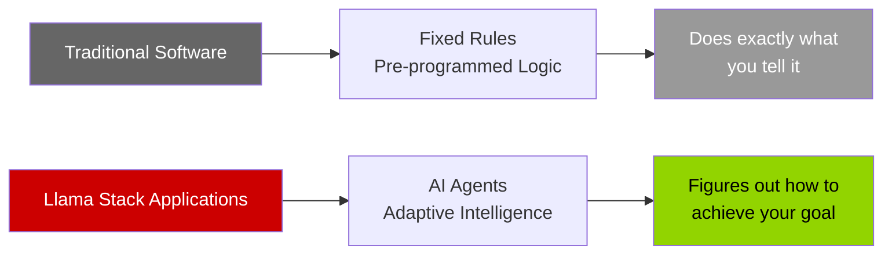
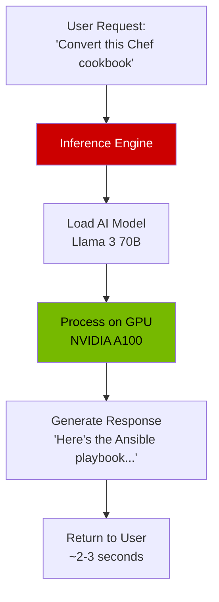
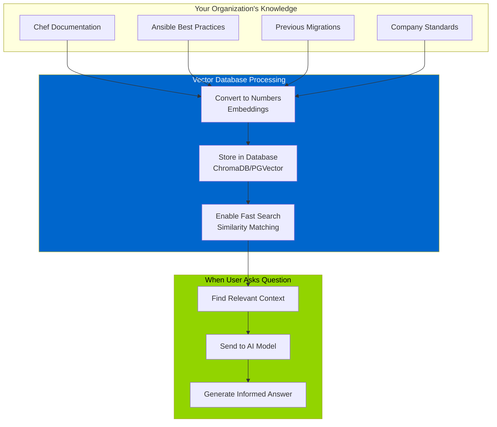
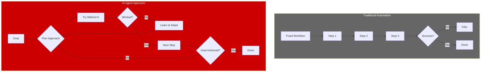
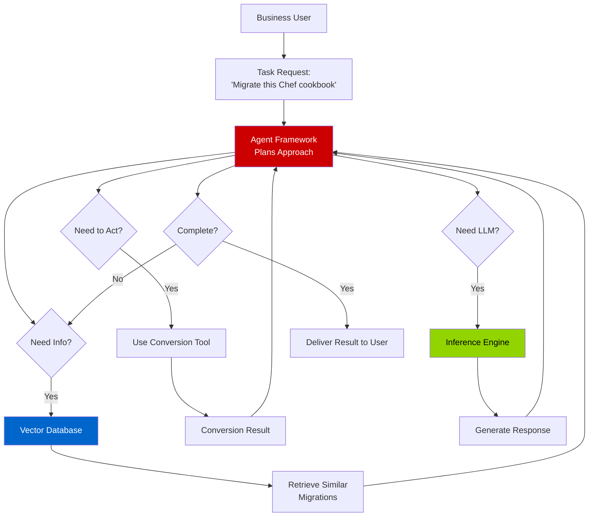
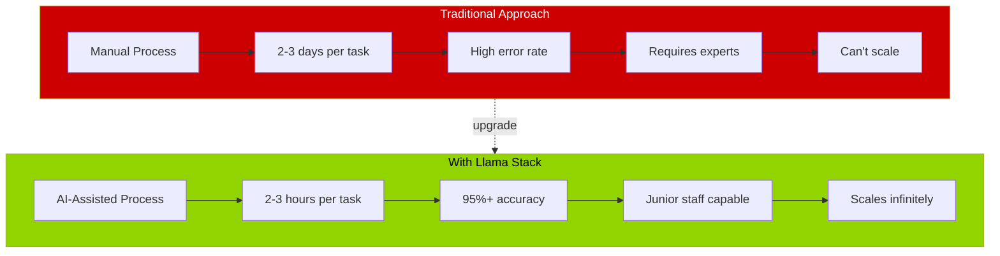
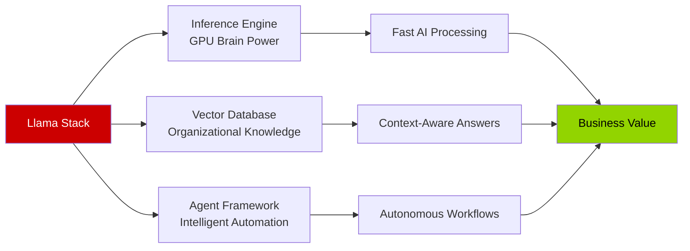

# Executive Slide 2: Understanding Llama Stack
## The AI Framework Inside OpenShift AI 3

---

## 🎯 What is Llama Stack?

**Llama Stack** is an open-source AI framework from Meta that provides everything needed to build intelligent applications with AI agents.

**Think of it as:** The operating system for AI applications - just like Linux runs your servers, Llama Stack runs your AI workloads.

---

## 📊 Llama Stack: Core Components

| Component | What It Does | Why You Need It | Business Value |
|-----------|--------------|-----------------|----------------|
| **Inference Engine** | Runs AI models on GPUs | Converts your GPU hardware into usable AI capabilities | **Process requests** from applications in real-time |
| **Vector Database** | Stores knowledge and context | Gives AI access to your organization's information | **AI answers questions** using your data, not just generic knowledge |
| **Agent Framework** | Orchestrates intelligent workflows | Enables AI to plan, use tools, and adapt | **Automates complex tasks** that previously required human judgment |

---

## 🔍 Component Deep Dive

### 1️⃣ Inference Engine - The "Brain Power"

**What It Is:**
- Software that runs large language models (LLMs) efficiently on your GPUs
- Uses **vLLM** technology for high-speed inference
- Handles multiple requests simultaneously

**Business Impact:**
- ✅ Fast response times (seconds, not minutes)
- ✅ High throughput (hundreds of users concurrently)
- ✅ Cost-efficient (maximize GPU utilization)

**Example Models You Can Run:**
| Model | Size | Capability | GPU Requirement |
|-------|------|------------|----------------|
| Llama 3 8B | Small | Fast, efficient responses | 1x L40s (16GB) |
| Llama 3 70B | Large | Complex reasoning, high quality | 1x A100 (80GB) |
| Mistral 7B | Small | Specialized tasks | 1x L40s (16GB) |
| Granite Code | Medium | Code generation | 1x L40s (24GB) |

---

### 2️⃣ Vector Database - The "Knowledge Base"

**What It Is:**
- A specialized database that stores information as **vectors** (mathematical representations)
- Enables "semantic search" - finding information by meaning, not just keywords
- Powers **RAG** (Retrieval-Augmented Generation) - AI that uses your documents

**Business Impact:**
- ✅ AI understands **your organization's** patterns and practices
- ✅ Answers are based on **your documentation**, not internet data
- ✅ Continuously learns from new information

**Real-World Example:**

| Without Vector DB | With Vector DB |
|-------------------|----------------|
| User: "How do we handle Chef templates?" AI: "Chef templates use ERB syntax..." *[generic answer]* | User: "How do we handle Chef templates?" AI: "Based on your previous migrations, you prefer Jinja2 with variable files stored in group_vars..." *[your pattern]* |

---

### 3️⃣ Agent Framework - The "Intelligent Worker"

**What It Is:**
- Software that gives AI the ability to:
  - **Plan** multi-step tasks
  - **Use tools** (APIs, commands, converters)
  - **Remember** context across interactions
  - **Adapt** when things don't go as expected

**Business Impact:**
- ✅ Handles tasks that previously required human judgment
- ✅ Works through complex problems autonomously
- ✅ Explains its reasoning and decisions

---

## 🔄 How These Components Work Together

**The Flow:**
1. User gives the Agent a goal
2. Agent **queries Vector DB** for relevant knowledge
3. Agent **plans** the approach using the Inference Engine
4. Agent **uses tools** to take actions
5. Agent **repeats** steps 2-4 until goal is achieved
6. Agent **delivers** the result

---

## 💼 Business Use Cases by Component

### Inference Engine Use Cases

| Use Case | Business Value | Example |
|----------|---------------|---------|
| **Conversational AI** | 24/7 expert assistance | IT helpdesk chatbot |
| **Content Generation** | Faster documentation | Generate runbooks from templates |
| **Code Translation** | Modernize legacy systems | Chef → Ansible migration |
| **Analysis** | Faster insights | Security log analysis |

---

### Vector Database Use Cases

| Use Case | Business Value | Example |
|----------|---------------|---------|
| **Knowledge Search** | Find expertise faster | "How did we solve this before?" |
| **Compliance** | Consistent standards | "Show me approved patterns" |
| **Learning** | Improve over time | Build organizational memory |
| **Context** | Better AI responses | Use company-specific terminology |

---

### Agent Framework Use Cases

| Use Case | Business Value | Example |
|----------|---------------|---------|
| **Workflow Automation** | Reduce manual work | End-to-end migration process |
| **Intelligent Routing** | Better decisions | Route tickets to right team |
| **Problem Solving** | Autonomous remediation | Self-healing infrastructure |
| **Data Integration** | Connect systems | Aggregate data from multiple sources |

---

## 📊 Llama Stack vs Traditional Approaches

---

## 🎯 Key Capabilities Summary

### What Llama Stack Enables

| Capability | Without Llama Stack | With Llama Stack |
|------------|---------------------|------------------|
| **AI Models** | Must use external APIs (OpenAI, Anthropic) | Run on your infrastructure Your data stays private |
| **Knowledge** | Generic internet knowledge | Your organization's patterns Your historical decisions |
| **Automation** | Fixed workflows only | Adaptive, intelligent workflows Handles exceptions |
| **Cost** | Pay per API call Unpredictable costs | Fixed infrastructure cost Unlimited usage |
| **Speed** | Network latency API rate limits | Local processing No external dependencies |
| **Security** | Data sent externally | Everything on-premises Zero data egress |

---

## 💡 Bottom Line

**Llama Stack provides three essential capabilities:**

**Together, these enable:**
- ✅ Running AI models on your GPUs (Inference)
- ✅ AI that knows your organization (Vector DB)
- ✅ AI that can work autonomously (Agents)

**Next:** Understanding what AI Agents are and how they work

---

