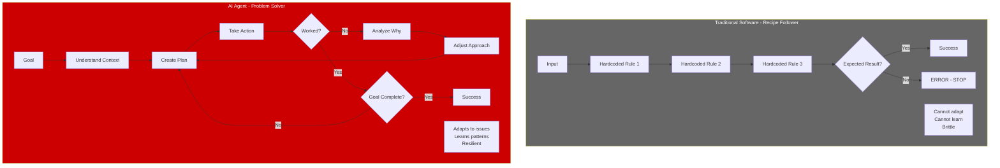
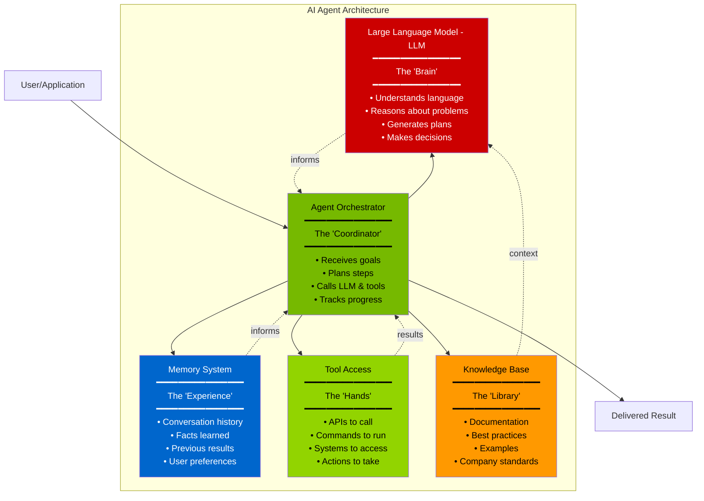
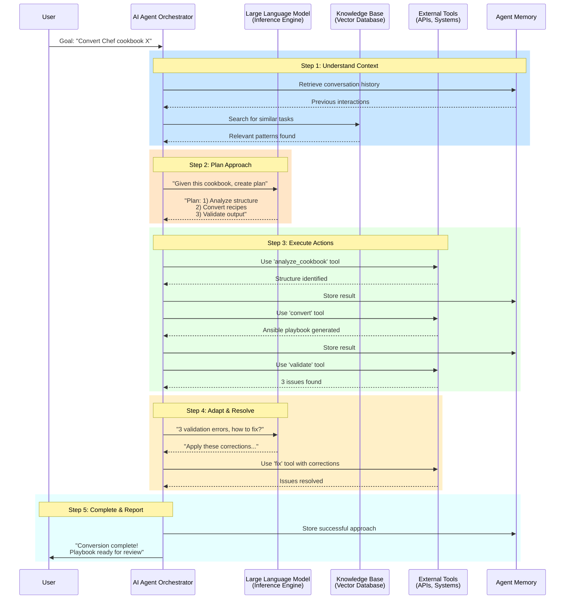
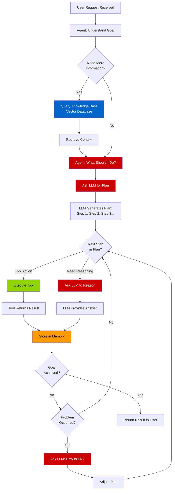
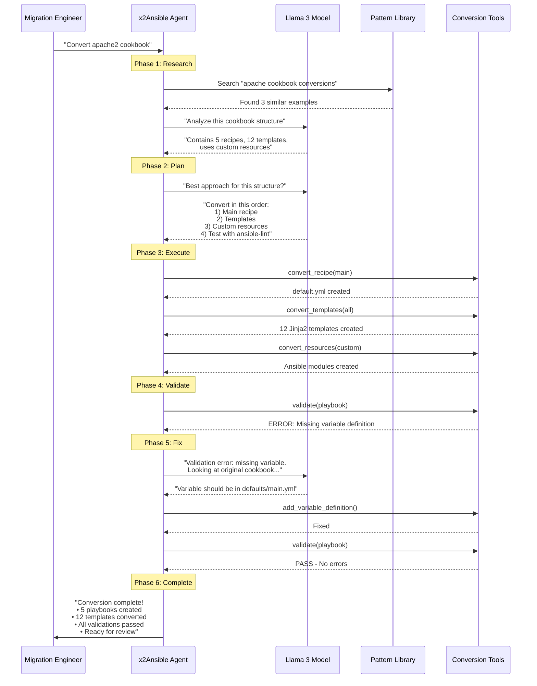
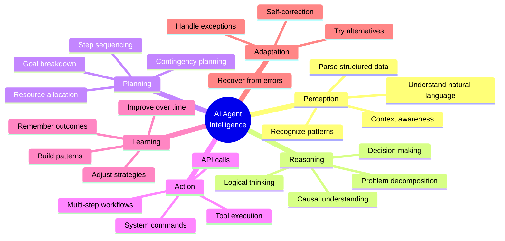
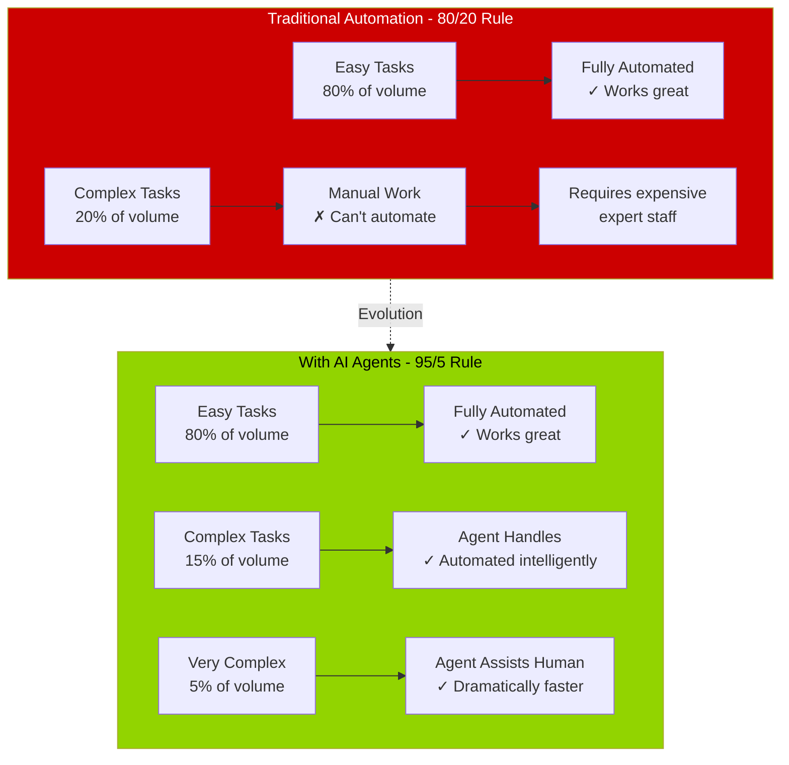
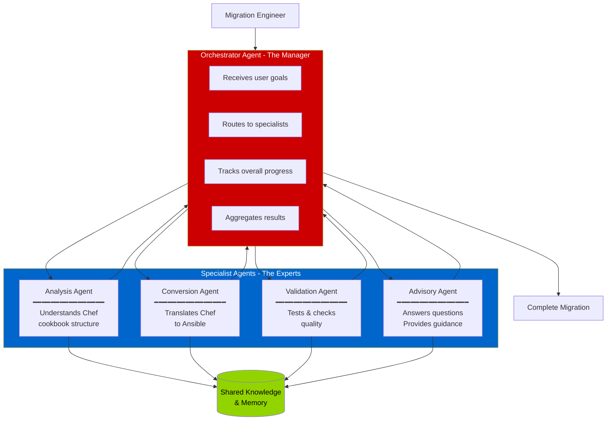
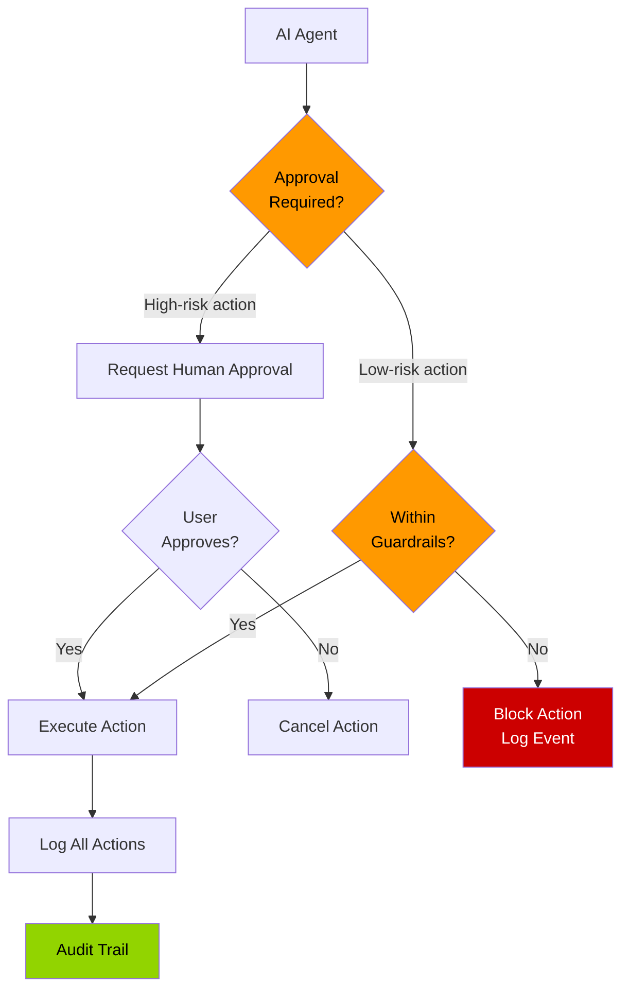
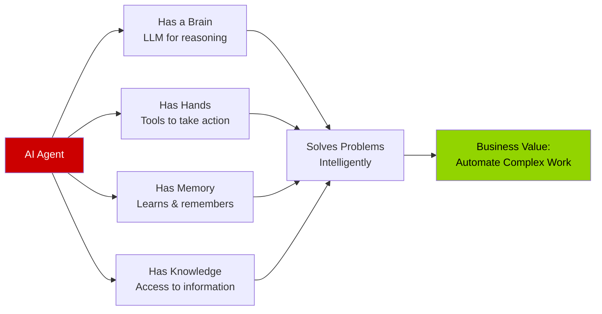

# Executive Slide 3: Understanding AI Agents
## The "Intelligent Worker" Concept

---

## 🤖 What is an AI Agent?

**Simple Definition:**
> An AI agent is software that can understand goals, plan how to achieve them, use tools to take actions, and adapt when things don't go as planned.

**Think of it like:** Hiring a smart assistant who can figure out how to complete tasks without step-by-step instructions.

---

## 📊 Traditional Software vs AI Agent

**Key Difference:**
- **Traditional Software:** "Follow these exact steps"
- **AI Agent:** "Achieve this goal - you figure out how"

---

## 🧠 The Core Components of an AI Agent

---

## 🔄 How an Agent Works: The Loop

**Key Insight:** The agent **loops through plan → act → learn** until the goal is achieved.

---

## 🛠️ Agent Interaction with Tools and LLMs

### The Decision Flow

---

## 🎯 Real-World Example: Chef to Ansible Migration

Let's see an agent handle a real task step-by-step:

**What Happened:**
1. ✅ Agent **searched** for similar patterns (Vector DB)
2. ✅ Agent **analyzed** the structure (LLM reasoning)
3. ✅ Agent **planned** the approach (LLM planning)
4. ✅ Agent **used tools** to convert (Tool execution)
5. ✅ Agent **detected problems** (Tool feedback)
6. ✅ Agent **fixed issues** autonomously (LLM problem-solving)
7. ✅ Agent **delivered results** (Orchestration)

**No human intervention needed for 95% of the work!**

---

## 🧩 The "Motherhood" Concept

### What Makes an Agent "Intelligent"

**The "Motherhood" Principles:**
1. **Autonomy** - Can work independently toward goals
2. **Adaptability** - Handles unexpected situations
3. **Learning** - Improves with experience
4. **Reasoning** - Understands "why" not just "what"
5. **Communication** - Explains its actions and decisions

---

## 💼 Business Value: Why Agents Matter

### Traditional Automation vs AI Agents

**Impact:**
- ❌ **Before:** 20% of work still manual, high cost
- ✅ **After:** Only 5% needs significant human involvement

---

## 📊 Agent Capabilities Comparison

| Capability | Traditional Software | AI Agent | Business Impact |
|------------|---------------------|----------|----------------|
| **Handle Exceptions** | ❌ Breaks on unexpected input | ✅ Adapts and works around issues | Fewer failures, less manual intervention |
| **Learn from Experience** | ❌ Same behavior every time | ✅ Improves with each task | Better results over time |
| **Explain Decisions** | ❌ Black box behavior | ✅ Can articulate reasoning | Easier to audit and trust |
| **Complex Problem Solving** | ❌ Can't handle nuance | ✅ Applies judgment and context | Automates higher-value work |
| **Natural Language Interface** | ❌ Requires specific commands | ✅ Understands plain English | Lower training requirements |
| **Multi-System Integration** | ❌ Rigid integrations | ✅ Dynamic tool use | Flexible across environments |

---

## 🎯 Agent Types in x2Ansible

**Multi-Agent Benefits:**
- ✅ **Specialization** - Each agent is expert in one domain
- ✅ **Parallel work** - Multiple agents work simultaneously
- ✅ **Resilience** - If one agent fails, others continue
- ✅ **Scalability** - Add more specialist agents as needed

---

## 🔐 Safety & Control

### How We Keep Agents Under Control

**Safety Mechanisms:**
1. ✅ **Guardrails** - Agent can only use approved tools
2. ✅ **Approval workflows** - Critical actions require human sign-off
3. ✅ **Audit logging** - Every action is recorded
4. ✅ **Rollback capability** - Can undo agent actions
5. ✅ **Sandboxed execution** - Agents run in isolated environments

---

## 💡 Key Takeaways

### What You Need to Remember

**An AI Agent is:**
- 🧠 **Intelligent** - Uses LLMs to reason and plan
- 🔧 **Capable** - Has access to tools and systems
- 💾 **Remembers** - Learns from experience
- 📚 **Informed** - Uses organizational knowledge
- 🔄 **Adaptive** - Handles exceptions gracefully
- 🎯 **Goal-oriented** - Focuses on outcomes, not steps

**Why This Matters for Your Business:**
- ✅ Automate work that previously required human judgment
- ✅ Scale expertise beyond your team size
- ✅ Reduce time-to-value for complex tasks
- ✅ Lower skill requirements (agent provides expertise)
- ✅ Consistent quality across all work

---

## 🚀 Next Steps

Now that you understand:
- ✅ Your infrastructure (OpenShift AI 3, GPUs, ACM)
- ✅ Llama Stack components (Inference, Vector DB, Agents)
- ✅ How AI Agents work (Brain + Hands + Memory + Knowledge)

**We can discuss:**
- How x2Ansible uses agents for Chef → Ansible migration
- Expected ROI and timelines
- Pilot project scope
- Team training requirements

---

