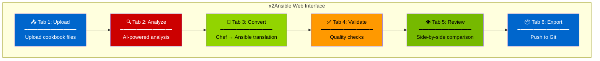
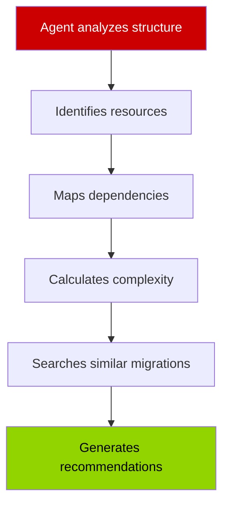
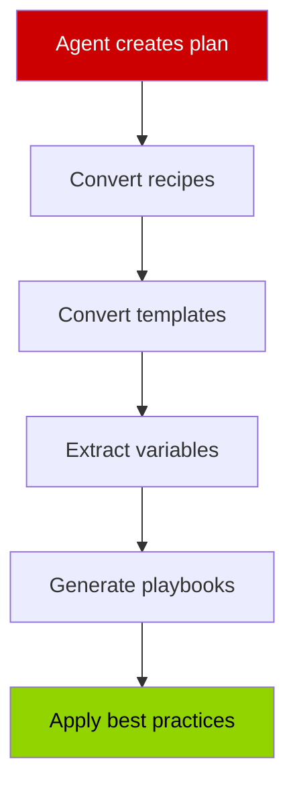
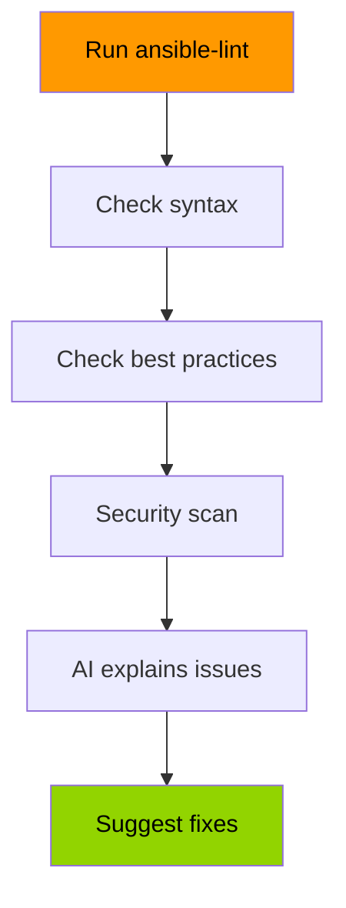
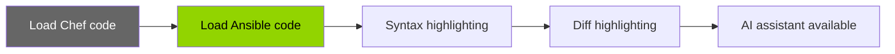
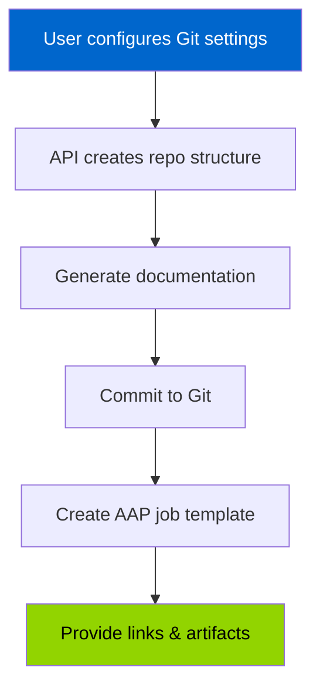
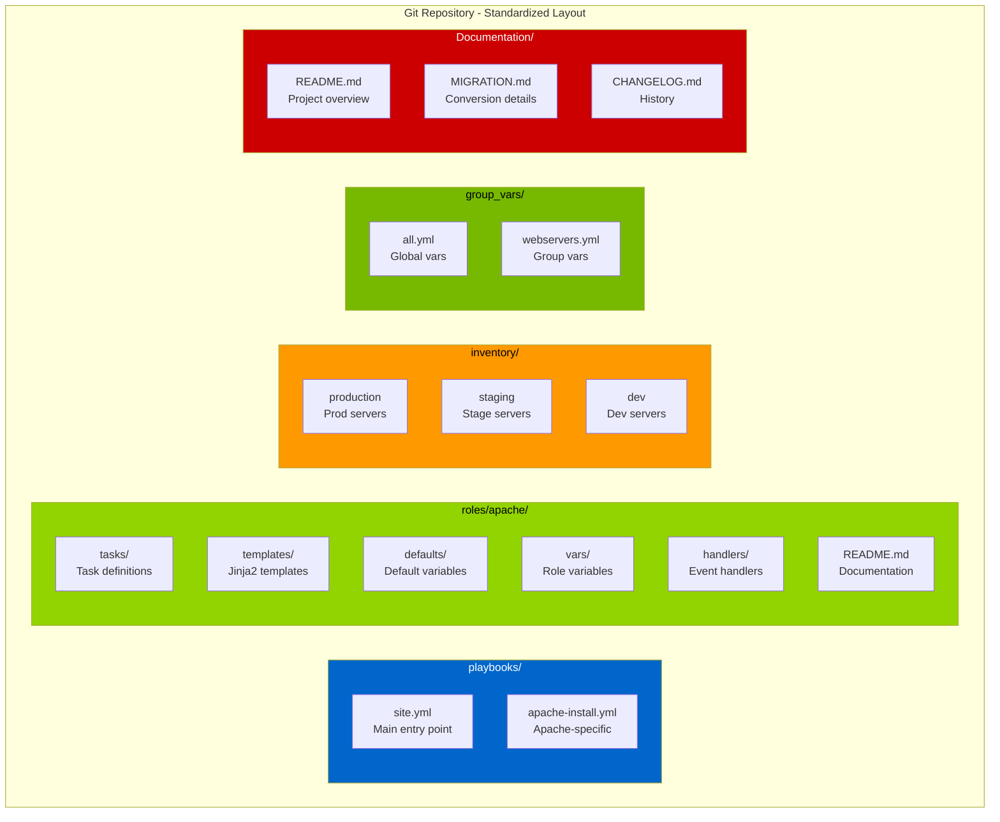
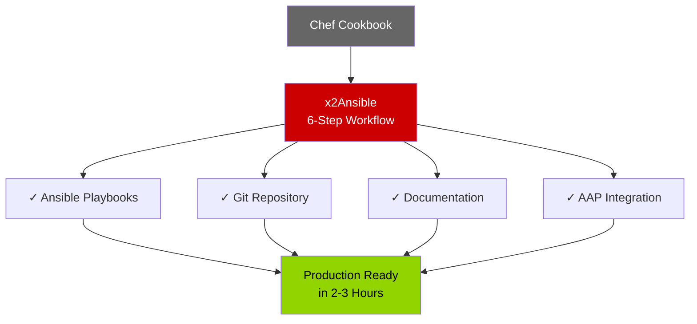

# Executive Slide 4: x2Ansible User Workflow
## From Cookbook Upload to Production-Ready Ansible

---

## 🎯 Overview: The Complete Migration Journey

**User Goal:** Convert a Chef cookbook to production-ready Ansible playbooks in a standardized Git repository

**Time Required:** 2-3 hours (vs 2-3 days manual)

**Skill Level:** Junior-to-mid level engineer (AI agent provides expertise)


---

## 📱 The x2Ansible User Interface

### UI Structure - Tab-Based Workflow



**Key Feature:** Guided workflow - each tab leads to the next, with clear progress indicators

---

## 🔄 Complete User Journey - Step by Step

```mermaid
sequenceDiagram
    autonumber
    participant User as Migration Engineer
    participant UI as x2Ansible UI<br/>(Browser)
    participant API as x2Ansible API<br/>(Backend)
    participant Agent as AI Agent<br/>(Llama Stack)
    participant Git as Git Repository<br/>(GitLab/GitHub)
    
    rect rgb(200, 220, 255)
        Note over User,API: STEP 1: Upload Cookbook
        User->>UI: Open x2Ansible interface
        User->>UI: Tab 1: Upload cookbook<br/>(drag & drop or browse)
        UI->>API: POST /api/upload
        API->>API: Validate files & structure
        API-->>UI: ✓ Upload successful<br/>Session ID created
        UI->>User: Display: Cookbook structure tree<br/>Next: Click "Analyze"
    end
    
    rect rgb(255, 220, 220)
        Note over User,Agent: STEP 2: AI Analysis
        User->>UI: Tab 2: Click "Analyze"
        UI->>API: POST /api/analyze
        API->>Agent: Initialize analysis
        Agent->>Agent: Parse Chef DSL<br/>Identify resources<br/>Map dependencies<br/>Calculate complexity
        Agent-->>API: Analysis complete
        API-->>UI: Return metrics & recommendations
        UI->>User: Display:<br/>• 5 recipes found<br/>• 12 templates<br/>• Complexity: Medium<br/>• Estimated time: 2 hours<br/>• Recommendations<br/>Next: Click "Convert"
    end
    
    rect rgb(220, 255, 220)
        Note over User,Agent: STEP 3: Automated Conversion
        User->>UI: Tab 3: Click "Start Conversion"
        UI->>API: POST /api/convert (streaming)
        API->>Agent: Execute conversion plan
        
        loop For each resource
            Agent->>Agent: Convert Chef → Ansible
            Agent-->>API: Progress update
            API-->>UI: SSE: 25% complete...
            UI->>User: Live progress bar & log
        end
        
        Agent-->>API: Conversion complete
        API-->>UI: Playbooks generated
        UI->>User: Display:<br/>• 5 playbooks created<br/>• 12 Jinja2 templates<br/>• Variables extracted<br/>Next: Click "Validate"
    end
    
    rect rgb(255, 240, 200)
        Note over User,Agent: STEP 4: Validation
        User->>UI: Tab 4: Click "Validate"
        UI->>API: POST /api/validate?profile=moderate
        API->>Agent: Run ansible-lint
        Agent->>Agent: Check syntax<br/>Check best practices<br/>Check security rules
        Agent-->>API: Validation results
        API-->>UI: Results + AI explanations
        UI->>User: Display:<br/>• 2 warnings (explained)<br/>• 0 errors<br/>• Suggestions for improvement<br/>Next: Click "Review"
    end
    
    rect rgb(230, 255, 255)
        Note over User,UI: STEP 5: Review
        User->>UI: Tab 5: Open Review
        UI->>UI: Load side-by-side diff
        UI->>User: Display:<br/>• Chef code (left)<br/>• Ansible code (right)<br/>• Highlighted differences<br/>• AI chat assistant available
        
        opt User has questions
            User->>UI: "Why was this converted this way?"
            UI->>API: POST /api/chat
            API->>Agent: RAG-powered Q&A
            Agent-->>API: Context-aware answer
            API-->>UI: Response with examples
            UI->>User: AI explains reasoning
        end
        
        User->>User: Manual review & approval
        User->>UI: Click "Approve & Export"
    end
    
    rect rgb(220, 220, 255)
        Note over User,Git: STEP 6: Export to Git
        User->>UI: Tab 6: Configure Git export<br/>• Repository URL<br/>• Branch name<br/>• Commit message
        User->>UI: Click "Push to Repository"
        UI->>API: POST /api/export
        API->>Git: Create standardized structure:<br/>├── playbooks/<br/>├── roles/<br/>├── templates/<br/>├── vars/<br/>├── README.md<br/>└── MIGRATION.md
        Git-->>API: Commit SHA
        API-->>UI: Export complete
        UI->>User: Display:<br/>✓ Pushed to main branch<br/>✓ Commit: abc123<br/>✓ Repository link<br/>✓ AAP job template created
    end
```



---

## 📋 Detailed Tab Breakdown

### Tab 1: 📤 Upload

**User Action:** Upload Chef cookbook files

**What Happens:**


**Input:**
- Chef cookbook folder (zip or individual files)
- Or Git repository URL

**Output:**
- Session ID created
- File structure tree displayed
- File count and size summary

**What User Sees:**
```
✓ Cookbook uploaded successfully
━━━━━━━━━━━━━━━━━━━━━━━━━━━━━
📁 apache2-cookbook/
  ├── 📁 recipes/
  │   ├── default.rb
  │   ├── mod_ssl.rb
  │   └── vhosts.rb
  ├── 📁 templates/
  │   ├── apache2.conf.erb
  │   └── ssl.conf.erb
  ├── 📁 attributes/
  │   └── default.rb
  └── metadata.rb

Next Step: Analyze cookbook structure →
```

---

### Tab 2: 🔍 Analyze

**User Action:** Click "Analyze" button

**What Happens:**


**Input:**
- Uploaded cookbook files
- Historical migration patterns (from Vector DB)

**Output:**
- Resource count and types
- Complexity score (Low/Medium/High)
- Time estimate
- Risk assessment
- Conversion recommendations

**What User Sees:**
```
📊 Analysis Complete
━━━━━━━━━━━━━━━━━━━━━━━━━━━━━

Resources Found:
  • 5 recipes
  • 12 templates (ERB → Jinja2)
  • 3 attribute files
  • 2 custom resources
  • 8 package dependencies

Complexity: 🟡 Medium
Estimated Conversion Time: 2.5 hours
Confidence: 95%

⚠️ Considerations:
  • Custom resources require manual review
  • SSL configuration detected - ensure certs are available
  • Ubuntu 18.04 specific - may need adjustment for RHEL

💡 AI Recommendation:
  Based on 15 similar Apache cookbook migrations,
  suggest using ansible.builtin.template module for 
  config files and ansible.builtin.service for daemon management.

Next Step: Start automated conversion →
```

---

### Tab 3: 🔄 Convert

**User Action:** Click "Start Conversion"

**What Happens:**


**Input:**
- Chef cookbook files
- Analysis results
- Organizational patterns (from Vector DB)

**Output:**
- Ansible playbooks (YAML)
- Jinja2 templates
- Variable files (defaults, vars)
- Role structure
- README documentation

**What User Sees (Live Stream):**
```
🔄 Conversion in Progress...
━━━━━━━━━━━━━━━━━━━━━━━━━━━━━

Progress: ████████████░░░░░░░░ 60%

✓ Converted recipes/default.rb → playbooks/site.yml
✓ Converted recipes/mod_ssl.rb → roles/apache/tasks/ssl.yml
✓ Converted templates/apache2.conf.erb → templates/apache2.conf.j2
⚙️ Converting recipes/vhosts.rb...

Conversion Log:
[12:34:15] Starting recipe conversion
[12:34:16] Identified 8 Chef resources
[12:34:17] Mapped to 8 Ansible tasks
[12:34:18] Applied organization naming conventions
[12:34:19] Generated variable file with 12 parameters
[12:34:20] Conversion complete

━━━━━━━━━━━━━━━━━━━━━━━━━━━━━
✓ Conversion Complete

Files Generated:
  • 5 playbook files
  • 12 Jinja2 templates
  • 3 variable files
  • 1 role structure
  • README.md

Next Step: Validate generated code →
```

---

### Tab 4: ✅ Validate

**User Action:** Click "Validate"

**What Happens:**


**Input:**
- Generated Ansible playbooks
- Validation profile (basic/moderate/safety)

**Output:**
- Validation report
- Error/warning list with explanations
- Suggested fixes
- Pass/fail status

**What User Sees:**
```
✅ Validation Results
━━━━━━━━━━━━━━━━━━━━━━━━━━━━━

Overall Status: ✓ PASS with 2 warnings

Profile: Moderate (ansible-lint)

━━━━━━━━━━━━━━━━━━━━━━━━━━━━━

⚠️ Warning 1: [no-changed-when]
File: roles/apache/tasks/main.yml, Line 15

  Issue:
    Command module used without 'changed_when' condition

  Code:
    - name: Check Apache status
      command: systemctl status apache2

  🤖 AI Explanation:
    The command module always reports "changed" status,
    which can trigger unnecessary handler runs. This is
    a read-only command, so it should never report changed.

  💡 Suggested Fix:
    - name: Check Apache status
      command: systemctl status apache2
      changed_when: false
      check_mode: false

  [Apply Fix Automatically] [Ignore]

━━━━━━━━━━━━━━━━━━━━━━━━━━━━━

⚠️ Warning 2: [var-naming]
File: defaults/main.yml, Line 8

  Issue:
    Variable name doesn't follow naming convention

  Code:
    apache_defaultPort: 80

  🤖 AI Explanation:
    Your organization uses snake_case for all variables.
    This uses camelCase, which is inconsistent.

  💡 Suggested Fix:
    apache_default_port: 80

  [Apply Fix Automatically] [Ignore]

━━━━━━━━━━━━━━━━━━━━━━━━━━━━━

✓ All critical checks passed
✓ No syntax errors
✓ No security issues

Next Step: Review conversion side-by-side →
```

---

### Tab 5: 👁️ Review

**User Action:** Review side-by-side comparison

**What Happens:**


**Input:**
- Original Chef code
- Generated Ansible code
- Conversion metadata

**Output:**
- Side-by-side comparison
- Highlighted differences
- Conversion rationale
- User approval decision

**What User Sees:**
```
👁️ Side-by-Side Review
━━━━━━━━━━━━━━━━━━━━━━━━━━━━━━━━━━━━━━━━━━━━━━━━━

Chef (Original)              │  Ansible (Generated)
━━━━━━━━━━━━━━━━━━━━━━━━━━━━┼━━━━━━━━━━━━━━━━━━━━━━━━━━━━━
                             │
package 'apache2' do         │  - name: Install Apache
  action :install            │    ansible.builtin.package:
end                          │      name: apache2
                             │      state: present
                             │
service 'apache2' do         │  - name: Start Apache service
  action [:enable, :start]   │    ansible.builtin.service:
  supports :restart => true  │      name: apache2
end                          │      state: started
                             │      enabled: yes
                             │
template '/etc/apache2/...   │  - name: Configure Apache
  source 'apache2.conf.erb'  │    ansible.builtin.template:
  owner 'root'               │      src: apache2.conf.j2
  group 'root'               │      dest: /etc/apache2/...
  mode '0644'                │      owner: root
  notifies :restart,         │      group: root
           resources(...)    │      mode: '0644'
end                          │    notify: Restart Apache
                             │
                             │  handlers:
                             │    - name: Restart Apache
                             │      ansible.builtin.service:
                             │        name: apache2
                             │        state: restarted

━━━━━━━━━━━━━━━━━━━━━━━━━━━━━━━━━━━━━━━━━━━━━━━━━

💬 AI Assistant Chat
━━━━━━━━━━━━━━━━━━━━━━━━━━━━━
You: Why did you move the restart to a handler?

🤖 AI: In Ansible best practices, actions like service 
restarts should be in handlers to avoid unnecessary 
restarts. Handlers only run when notified by a task 
that made changes. This is more efficient than Chef's 
inline notifications.

━━━━━━━━━━━━━━━━━━━━━━━━━━━━━

[Ask AI a Question] [Previous File] [Next File] [Approve & Export]
```

---

### Tab 6: 📦 Export

**User Action:** Configure and push to Git

**What Happens:**


**Input:**
- Git repository URL
- Branch name
- Commit message
- Author info
- Export options (include test playbooks, etc.)

**Output:**
- Standardized Git repository structure
- Generated documentation
- Git commit SHA
- AAP job template (optional)
- Download archive

**What User Sees:**
```
📦 Export to Git Repository
━━━━━━━━━━━━━━━━━━━━━━━━━━━━━

Repository Configuration:
  URL: git@github.com:company/ansible-playbooks.git
  Branch: feature/apache-migration
  Path: roles/apache/

Repository Structure:
  ├── playbooks/
  │   └── apache-install.yml          # Main playbook
  ├── roles/
  │   └── apache/
  │       ├── tasks/
  │       │   ├── main.yml
  │       │   ├── install.yml
  │       │   └── ssl.yml
  │       ├── templates/
  │       │   ├── apache2.conf.j2
  │       │   └── ssl.conf.j2
  │       ├── defaults/
  │       │   └── main.yml             # Default variables
  │       ├── vars/
  │       │   └── main.yml             # Role variables
  │       ├── handlers/
  │       │   └── main.yml             # Service handlers
  │       └── README.md                # Role documentation
  ├── inventory/
  │   └── example-hosts.yml            # Sample inventory
  ├── group_vars/
  │   └── all.yml                      # Global variables
  ├── MIGRATION.md                     # Conversion details
  └── README.md                        # Project overview

Documentation Generated:
  ✓ README.md - Role usage and variables
  ✓ MIGRATION.md - Conversion notes and mapping
  ✓ CHANGELOG.md - Migration history
  ✓ requirements.yml - Ansible Galaxy dependencies

[Commit Message]
─────────────────────────────────────────────────
Migrate Apache cookbook to Ansible role

- Converted Chef apache2 cookbook v3.8.14
- Generated role structure with 5 playbooks
- Converted 12 ERB templates to Jinja2
- Validated with ansible-lint (0 errors, 2 warnings)
- AI-assisted conversion completed in 2.3 hours

Co-authored-by: x2Ansible AI Agent
─────────────────────────────────────────────────

[Push to Repository]

━━━━━━━━━━━━━━━━━━━━━━━━━━━━━

✓ Export Complete!

Git Repository:
  • Branch: feature/apache-migration
  • Commit: a7f3d92
  • Files: 18 files changed, 847 insertions
  • View: https://github.com/company/ansible-playbooks/commit/a7f3d92

Ansible Automation Platform:
  • Job Template: "Apache Installation"
  • Created: Yes
  • Launch: https://aap.company.com/jobs/templates/123

Download Options:
  📥 Download as ZIP
  📥 Download tarball
  📥 Export to Ansible Galaxy

Next Actions:
  • Test playbook in dev environment
  • Create pull request for review
  • Update CI/CD pipeline
  • Schedule production rollout

[Start New Migration] [View in AAP] [Close]
```

---

## 📁 Standardized Git Repository Output

### Final Repository Structure



---

## 📄 Generated Documentation Examples

### README.md (Auto-generated)

```markdown
# Apache Web Server Ansible Role

Converted from Chef cookbook: apache2 v3.8.14
Migration completed: 2024-10-29
Conversion tool: x2Ansible AI Agent

## Description

Installs and configures Apache HTTP Server on Ubuntu/Debian systems.

## Requirements

- Ansible 2.9+
- Ubuntu 20.04+ or Debian 11+
- Sudo access

## Role Variables

| Variable | Default | Description |
|----------|---------|-------------|
| `apache_port` | 80 | HTTP listen port |
| `apache_ssl_port` | 443 | HTTPS listen port |
| `apache_user` | www-data | Apache process user |
| `apache_group` | www-data | Apache process group |
| `apache_enable_ssl` | false | Enable SSL module |

## Example Playbook

```yaml
- hosts: webservers
  roles:
    - role: apache
      apache_port: 8080
      apache_enable_ssl: true
```

## Testing

Run validation:
```bash
ansible-playbook playbooks/apache-install.yml --check
```

## Migration Notes

See MIGRATION.md for Chef → Ansible conversion details.
```

---

### MIGRATION.md (Auto-generated)

```markdown
# Chef to Ansible Migration Report

## Source Information

- **Chef Cookbook:** apache2
- **Version:** 3.8.14
- **Migration Date:** 2024-10-29 12:34:15
- **Migrated By:** engineer@company.com
- **AI Agent:** x2Ansible v2.0

## Conversion Summary

| Metric | Count |
|--------|-------|
| Chef Recipes | 5 |
| Chef Templates | 12 |
| Chef Attributes | 3 files |
| Ansible Playbooks | 5 |
| Ansible Tasks | 47 |
| Jinja2 Templates | 12 |
| Variables Extracted | 28 |

## Resource Mapping

### Recipes → Playbooks/Tasks

| Chef Recipe | Ansible Equivalent | Notes |
|-------------|-------------------|-------|
| `recipes/default.rb` | `tasks/main.yml` | Main entry point |
| `recipes/mod_ssl.rb` | `tasks/ssl.yml` | SSL configuration |
| `recipes/vhosts.rb` | `tasks/vhosts.yml` | Virtual host setup |

### Templates → Templates

| Chef Template | Ansible Template | Changes |
|---------------|------------------|---------|
| `apache2.conf.erb` | `apache2.conf.j2` | ERB → Jinja2 syntax |
| `ssl.conf.erb` | `ssl.conf.j2` | Variable name updates |

### Attributes → Variables

Chef attributes consolidated into:
- `defaults/main.yml` - Default values
- `vars/main.yml` - Role-specific overrides

## AI Recommendations Applied

1. ✓ Moved service restarts to handlers
2. ✓ Used fully-qualified module names (ansible.builtin.*)
3. ✓ Applied organization naming conventions
4. ✓ Added check mode support
5. ✓ Included example inventory

## Validation Results

- ansible-lint: ✓ PASS (0 errors, 2 warnings resolved)
- ansible-playbook --syntax-check: ✓ PASS
- YAML lint: ✓ PASS

## Manual Review Required

- [ ] SSL certificate paths (environment-specific)
- [ ] Log file locations
- [ ] Custom module `company_apache_metrics` needs review

## Testing Checklist

- [ ] Test in dev environment
- [ ] Verify all handlers trigger correctly
- [ ] Validate SSL configuration
- [ ] Check file permissions
- [ ] Performance test with production load

## Rollback Plan

Original Chef cookbook archived at:
`git@github.com:company/chef-cookbooks.git` (tag: pre-migration-backup)
```

---

## 🎯 Key Workflow Benefits

### User Experience


**What Makes This Effective:**

| Feature | Benefit | Business Impact |
|---------|---------|-----------------|
| **Tab-based navigation** | Clear progression | Reduced training time |
| **Live progress updates** | Transparency | User confidence |
| **AI explanations** | Learning opportunity | Skill development |
| **Side-by-side review** | Easy validation | Catch issues early |
| **Standardized output** | Consistency | Easy maintenance |
| **Auto-documentation** | No manual docs | Time savings |

---

## 📊 Time Comparison

### Manual Process vs x2Ansible

```mermaid
gantt
    title Migration Time Comparison
    dateFormat HH:mm
    axisFormat %H:%M
    
    section Manual
    Understand Chef cookbook     :m1, 00:00, 4h
    Plan Ansible structure       :m2, after m1, 2h
    Write Ansible tasks          :m3, after m2, 8h
    Convert templates            :m4, after m3, 3h
    Test and debug               :m5, after m4, 4h
    Write documentation          :m6, after m5, 3h
    
    section x2Ansible
    Upload & analyze             :a1, 00:00, 10m
    AI conversion                :a2, after a1, 45m
    Validation                   :a3, after a2, 15m
    Review & approve             :a4, after a3, 45m
    Export & document            :a5, after a4, 5m
```



**Results:**
- ❌ **Manual:** 24 hours (3 days)
- ✅ **x2Ansible:** 2 hours
- 📈 **Improvement:** 12x faster

---

## 💡 Key Takeaways

**For Management:**

1. **Simple User Experience**
   - 6 clear steps, guided workflow
   - No AI expertise required
   - Junior engineers can execute

2. **Quality Assurance Built-In**
   - Automated validation at every step
   - AI explains all decisions
   - Human review before deployment

3. **Standardized Output**
   - Consistent Git repository structure
   - Auto-generated documentation
   - Ready for AAP integration

4. **Traceable & Auditable**
   - Every step logged
   - Conversion rationale documented
   - Git history preserved

5. **Production Ready**
   - Validated code
   - Tested structure
   - Complete documentation
   - AAP job templates created

---

## 🎯 Success Criteria



**Delivered Results:**
- ✅ Production-quality Ansible code
- ✅ Standardized Git repository with documentation
- ✅ AAP job template ready to run
- ✅ Complete audit trail
- ✅ 12x faster than manual migration

---

**Next Steps:**
- Run pilot migration with 5 representative cookbooks
- Measure actual time savings
- Gather user feedback
- Scale to full migration program

---

