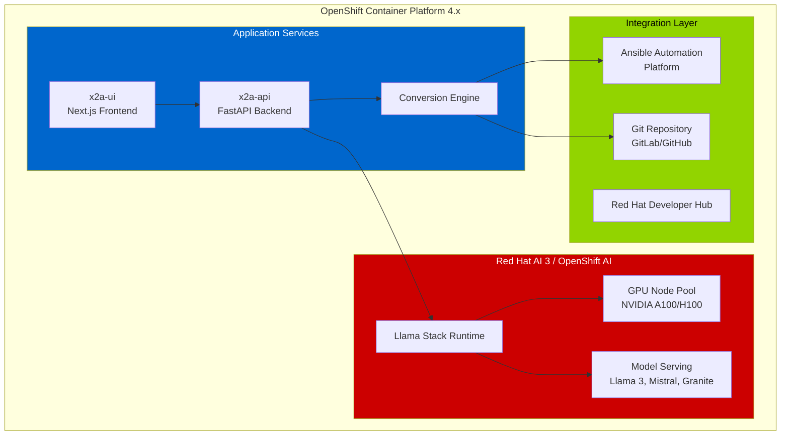
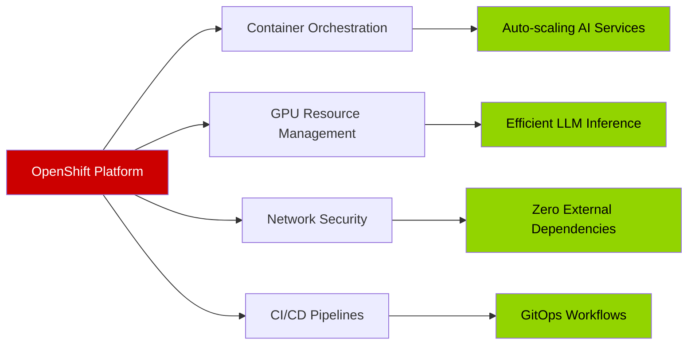
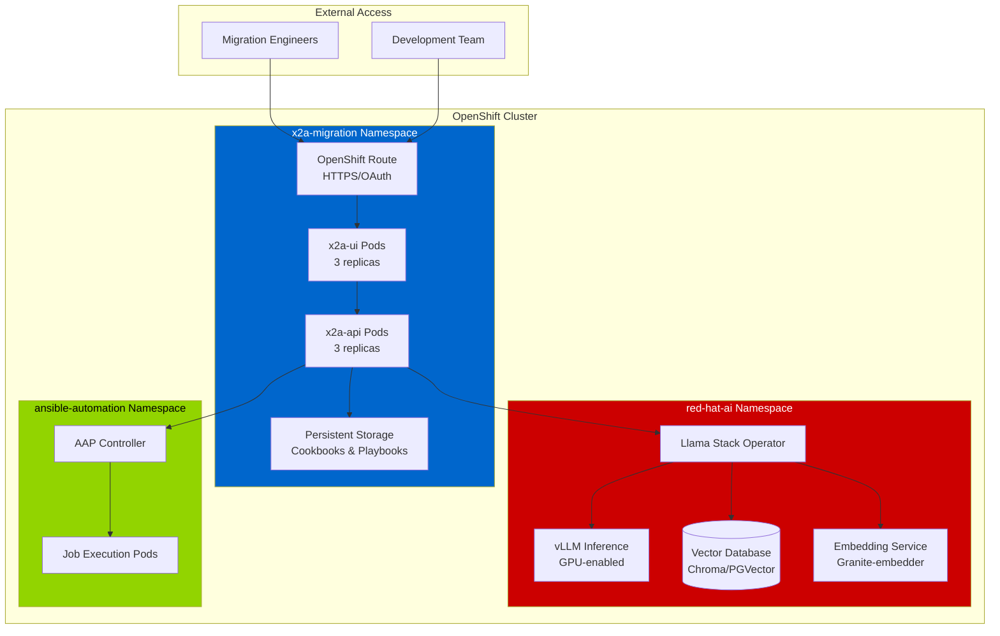

# Slide 1: Platform Foundation
## Red Hat AI 3 on OpenShift - Your AI Infrastructure

---

## 🎯 The Challenge: Chef → Ansible Migration

**Business Driver**: Modernize legacy Chef automation infrastructure

- Chef license costs and EOL concerns
- Need to centralize on Ansible Automation Platform (AAP)
- Manual translation is time-consuming and error-prone
- Require compliance and validation guardrails

**Solution**: AI-augmented migration using your existing infrastructure

---

## 🏗️ Your Platform Stack

---

## 🔴 Red Hat AI 3: Enterprise AI Platform

**What it provides:**

| Component | Capability |
|-----------|------------|
| **Llama Stack** | Open-source AI framework for agents and models |
| **GPU Acceleration** | On-cluster inference with vLLM runtime |
| **Model Serving** | Deploy Llama 3, Mistral, Granite, Phi models |
| **Security** | OAuth, RBAC, network policies - all within OpenShift |
| **Integration** | Native connections to AAP, Git, Developer Hub |

**Key Value**: Run powerful AI workloads securely on your infrastructure - no external API calls required

---

## 🔧 OpenShift Foundation Benefits

**Why this matters:**
- ✅ Enterprise-grade reliability and support
- ✅ GPU resources already available
- ✅ Secure, air-gapped deployment possible
- ✅ Integrates with existing automation workflows

---

## 📊 Deployment Architecture

---

## 💡 Key Takeaway

**You already have everything needed:**
- ✅ OpenShift cluster with GPU nodes
- ✅ Red Hat AI 3 with Llama Stack
- ✅ Integration with AAP
- ✅ Secure, on-premises AI capabilities

**Next**: Understanding how AI Agents work within this stack

