# Slide 2: Understanding AI Agents & Llama Stack
## What Makes This System "Intelligent"

---

## 🤖 What is an AI Agent?

**Traditional Software** vs **AI Agent**


**Key Difference**: An AI Agent can:
- 🧠 **Reason** about what to do next
- 🔧 **Use tools** to accomplish tasks (call APIs, run commands)
- 💾 **Remember** previous interactions
- 🔄 **Adapt** when things don't go as planned
- 📚 **Learn** from knowledge bases (RAG)

---

## 🏗️ Llama Stack Architecture (Inside Red Hat AI 3)

```mermaid
graph TB
    subgraph Client[Client Applications]
        UI[x2a-ui]
        API[x2a-api]
        Other[Other Apps]
    end
    
    subgraph LlamaStack[Llama Stack Components]
        subgraph AgentLayer[Agent Framework Layer]
            AgentSDK[Llama Agents SDK<br/>━━━━━━━━━━━━━━━━<br/>• Multi-agent orchestration<br/>• Task planning & routing<br/>• Message passing between agents]
            
            ToolsAPI[Tools & Actions API<br/>━━━━━━━━━━━━━━━━<br/>• JSON-based tool definitions<br/>• AAP integration<br/>• Git operations<br/>• HTTP/REST calls<br/>• Custom converters]
            
            Memory[Agent Memory Service<br/>━━━━━━━━━━━━━━━━<br/>• Session state persistence<br/>• Conversation history<br/>• Context accumulation<br/>• Facts & preferences]
        end
        
        subgraph ModelLayer[Model & Inference Layer]
            Gateway[Model Gateway API<br/>━━━━━━━━━━━━━━━━<br/>• Unified REST/gRPC interface<br/>• Load balancing<br/>• Request routing]
            
            vLLM[vLLM Runtime Adapter<br/>━━━━━━━━━━━━━━━━<br/>• GPU-accelerated inference<br/>• Parallel processing<br/>• Token streaming<br/>• Batch optimization]
            
            Embed[Embedding Engines<br/>━━━━━━━━━━━━━━━━<br/>• Text → Vector conversion<br/>• Granite-embedder<br/>• Multi-lingual support]
        end
        
        subgraph DataLayer[Data & Knowledge Layer]
            VectorDB[(Vector Database<br/>━━━━━━━━━━━━━━━━<br/>Chroma / PGVector<br/>━━━━━━━━━━━━━━━━<br/>• Embedding storage<br/>• Similarity search<br/>• Metadata filtering)]
            
            RAG[RAG Orchestrator<br/>━━━━━━━━━━━━━━━━<br/>• Query understanding<br/>• Context retrieval<br/>• Response augmentation<br/>• Source attribution]
            
            Telemetry[Observability<br/>━━━━━━━━━━━━━━━━<br/>• Trace logging<br/>• Token metrics<br/>• Performance monitoring]
        end
        
        subgraph OpsLayer[Operations Layer]
            Operator[Llama Stack Operator<br/>━━━━━━━━━━━━━━━━<br/>• Component deployment<br/>• Health checks<br/>• Auto-scaling rules]
            
            GPUCtrl[Inference Controller<br/>━━━━━━━━━━━━━━━━<br/>• GPU allocation<br/>• Resource quotas<br/>• Pod lifecycle management]
        end
    end
    
    subgraph Infrastructure[OpenShift Infrastructure]
        GPUs[GPU Node Pool<br/>NVIDIA A100/H100]
        Storage[(Persistent Volumes)]
    end
    
    Client --> AgentSDK
    AgentSDK --> ToolsAPI
    AgentSDK --> Memory
    AgentSDK --> Gateway
    Gateway --> vLLM
    Gateway --> Embed
    vLLM --> GPUs
    Embed --> VectorDB
    ToolsAPI --> RAG
    RAG --> VectorDB
    Memory --> Storage
    Operator --> GPUCtrl
    GPUCtrl --> GPUs
    
    style AgentLayer fill:#cc0000,color:#fff
    style ModelLayer fill:#0066cc,color:#fff
    style DataLayer fill:#92d400,color:#000
    style OpsLayer fill:#666,color:#fff
```



---

## 🔍 Deep Dive: Agent Framework Components

### 1️⃣ **Llama Agents SDK** - The "Brain"


**What it does:**
- Breaks down complex requests into steps
- Decides which tools to use and when
- Manages multiple specialized agents working together

---

### 2️⃣ **Tools API** - The "Hands"

Agents can call external systems as tools:

| Tool Type | Example | Purpose |
|-----------|---------|---------|
| **Converter** | `chef_to_ansible()` | Parse and translate cookbook syntax |
| **Validator** | `ansible_lint()` | Check generated playbook quality |
| **Repository** | `git_commit()` | Save converted playbooks |
| **Executor** | `aap_dry_run()` | Test playbook before production |
| **Knowledge** | `search_docs()` | Find best practices in documentation |


---

### 3️⃣ **Memory Service** - The "Knowledge"

**Two types of memory:**

```mermaid
graph TB
    subgraph ShortTerm[Short-Term Memory]
        ST1[Current Conversation]
        ST2[Recent Actions]
        ST3[Intermediate Results]
    end
    
    subgraph LongTerm[Long-Term Memory - Vector DB]
        LT1[Migration Patterns]
        LT2[Success/Failure Cases]
        LT3[Chef → Ansible Mappings]
        LT4[Best Practices]
    end
    
    Agent[AI Agent] --> ShortTerm
    Agent --> LongTerm
    ShortTerm --> Decision[Next Action Decision]
    LongTerm --> Decision
    
    style Agent fill:#cc0000,color:#fff
    style Decision fill:#92d400,color:#000
```



**Why this matters:**
- Agents don't forget context mid-conversation
- Learn from previous migrations
- Apply organization-specific patterns

---

## 🔎 Retrieval-Augmented Generation (RAG)

**The Problem**: LLMs don't know your specific Chef → Ansible patterns

**The Solution**: RAG

```mermaid
flowchart LR
    Q[User Question:<br/>"How to convert<br/>Chef templates?"]
    
    Q --> Embed[Convert to Vector]
    Embed --> Search[(Vector DB Search:<br/>Find similar questions)]
    Search --> Retrieve[Retrieve Relevant Docs:<br/>• Template conversion guide<br/>• Example mappings<br/>• Best practices]
    Retrieve --> Augment[Combine with Question]
    Augment --> LLM[Send to LLM]
    LLM --> Answer[Contextual Answer:<br/>"Chef ERB templates map to<br/>Jinja2 in Ansible...<br/>Here's an example..."]
    
    style Embed fill:#0066cc,color:#fff
    style Search fill:#92d400,color:#000
    style LLM fill:#cc0000,color:#fff
```

**Process:**
1. Your documents are converted to **vectors** (numerical representations)
2. User questions are also converted to vectors
3. System finds **most similar** documents to the question
4. LLM uses these documents to generate accurate, specific answers

---

## 🚀 Model & Inference Layer

### vLLM Runtime - GPU-Accelerated Inference


**Why vLLM is fast:**
- **Parallel processing** across GPUs
- **Batch optimization** - multiple requests at once
- **Continuous batching** - no waiting for slow requests
- **KV-cache** - remembers context efficiently

---

## 💡 Key Takeaways

**Llama Stack provides:**

| Component | What It Does | Why You Need It |
|-----------|--------------|-----------------|
| **Agent SDK** | Orchestrates complex workflows | Handles multi-step migrations automatically |
| **Tools API** | Connects to external systems | Integrates with AAP, Git, converters |
| **Memory** | Remembers context | Provides consistent, learning behavior |
| **RAG** | Searches knowledge base | Answers specific to your Chef patterns |
| **vLLM** | Runs models fast on GPU | Real-time responses at scale |

**Next**: How x2Ansible uses these capabilities

