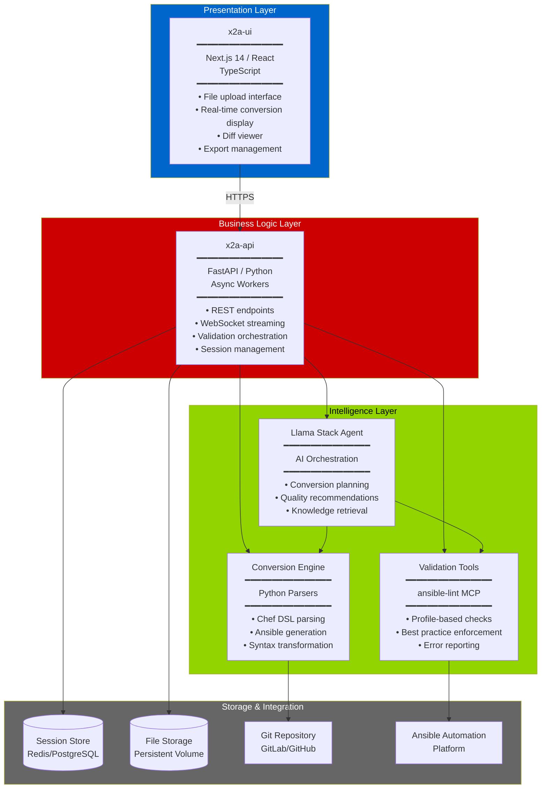
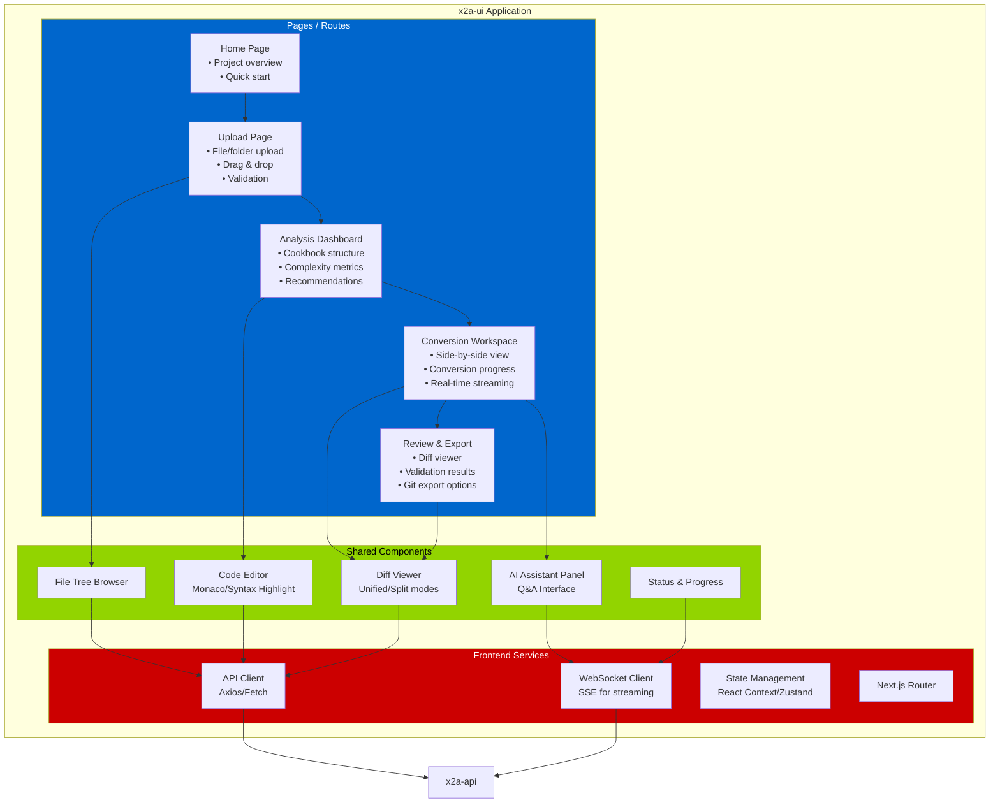
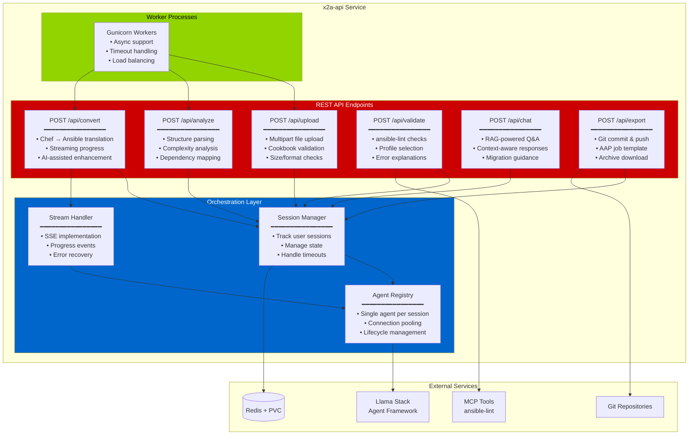
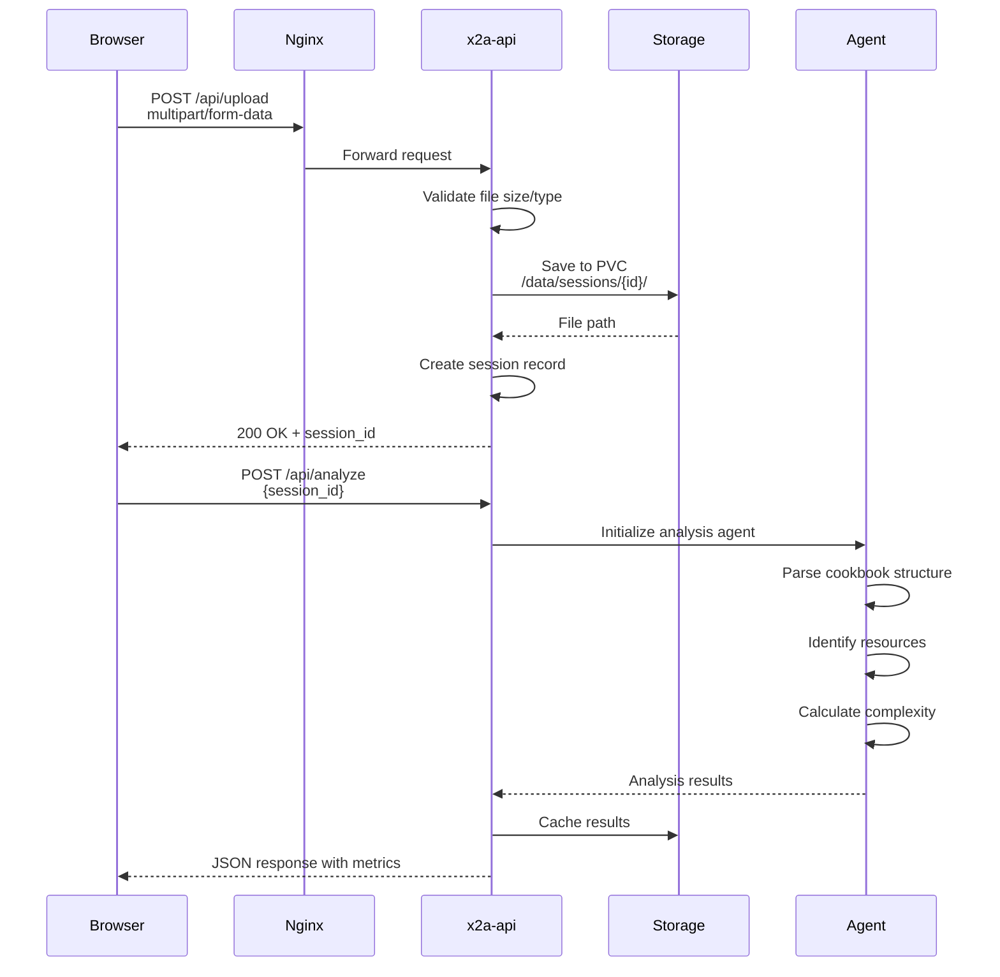
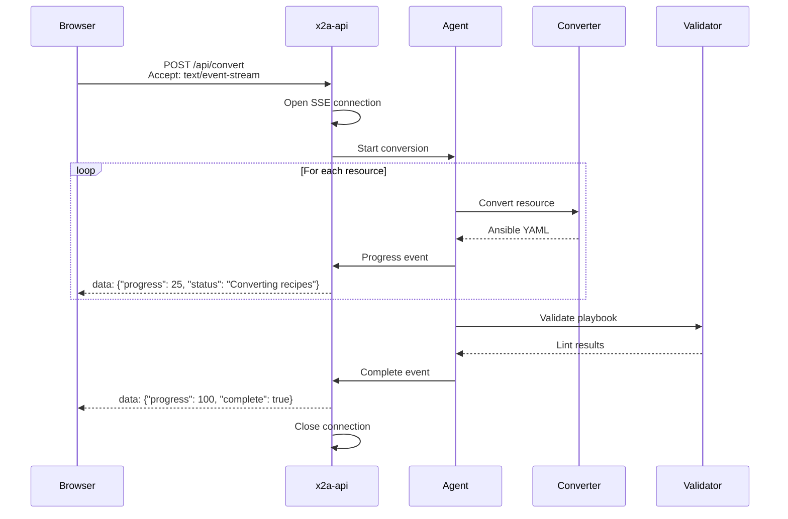
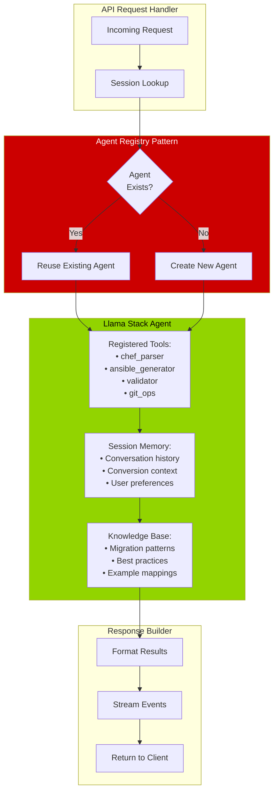
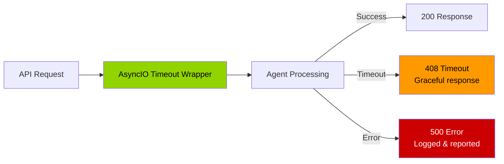

# Slide 3: The x2Ansible Solution
## Architecture & Component Flow

---

## 🎯 x2Ansible: Three-Tier Architecture



---

## 🌐 x2a-ui: User Interface Components

**Source**: [github.com/x2ansible/x2a-ui](https://github.com/x2ansible/x2a-ui)



**Key UI Features:**
- 📤 **Drag-and-drop upload** for Chef cookbooks
- 🔍 **Live analysis** with complexity scoring
- 🤖 **AI chat assistant** for questions during migration
- 📊 **Side-by-side diff** showing Chef vs Ansible
- ✅ **Real-time validation** feedback
- 📦 **One-click export** to Git/AAP

---

## ⚙️ x2a-api: Backend Service Architecture

**Source**: [github.com/x2ansible/x2a-api](https://github.com/x2ansible/x2a-api)



---

## 🔄 API Request Flow Examples

### Example 1: File Upload → Analysis



---

### Example 2: Streaming Conversion



---

## 🛠️ Agent Integration Pattern

**How x2a-api leverages Llama Stack agents:**



**Key Pattern Benefits:**
- ✅ **Agent reuse** - maintains context across requests
- ✅ **Memory persistence** - agent remembers conversation
- ✅ **Tool access** - can call converters, validators, Git
- ✅ **RAG integration** - answers questions with retrieved knowledge

---

## 🔐 Security & Error Handling

### Timeout Protection



**Protections in place:**
- ⏱️ **120s timeout** for validation endpoints
- ⏱️ **300s timeout** for conversion endpoints  
- 📦 **10MB size limit** on uploads
- 🔒 **Session isolation** - no cross-contamination
- 🔄 **Graceful degradation** on agent failures

---

### Model Context Protocol (MCP) Integration

```mermaid
graph TB
    subgraph API[x2a-api]
        Validate[Validation Request]
    end
    
    subgraph MCP[MCP Layer]
        Client[MCP Client]
        ToolGroup[ansible-lint Toolgroup]
    end
    
    subgraph LlamaStack[Llama Stack]
        Agent[Llama Agent]
        ToolRegistry[Tool Registry]
    end
    
    subgraph Execution[Execution]
        Lint[ansible-lint Process]
        Rules[Lint Profiles:<br/>• basic<br/>• moderate<br/>• safety]
    end
    
    Validate --> Agent
    Agent --> ToolRegistry
    ToolRegistry --> Client
    Client --> ToolGroup
    ToolGroup --> Lint
    Lint --> Rules
    Rules -->> Lint
    Lint -->> ToolGroup
    ToolGroup -->> Client
    Client -->> ToolRegistry
    ToolRegistry -->> Agent
    Agent -->> Validate
    
    style MCP fill:#0066cc,color:#fff
    style Execution fill:#92d400,color:#000
```

**Why MCP matters:**
- 🔌 **Standardized tool protocol** for AI agents
- 🧰 **Structured responses** from ansible-lint
- 📊 **Profile-based validation** (basic, moderate, safety)
- 🔄 **Reusable across agents**

---

## 💡 Key Takeaways

**x2a-ui provides:**
- Modern, responsive interface for migration workflow
- Real-time feedback and AI-assisted guidance
- Integrated diff viewer and export tools

**x2a-api provides:**
- RESTful endpoints for all migration operations
- Streaming support for long-running conversions
- Agent orchestration with Llama Stack
- Secure session management and error handling

**Together they create:**
- Seamless user experience
- AI-augmented automation
- Enterprise-grade reliability

**Next**: Complete end-to-end workflow

