# Slide 4: End-to-End Migration Workflow
## Complete Process with AI Augmentation

---

## 🎯 The Complete Migration Journey


---

## 🔄 Detailed Sequence: UI + API + Agent Collaboration


---

## 🤖 Conversational AI Workflow

**The AI agent doesn't just convert - it guides the entire process**

```mermaid
stateDiagram-v2
    [*] --> Greeting: User starts session
    
    state "Greeting & Context Gathering" as Greeting {
        [*] --> Welcome
        Welcome --> AskAboutCookbook: Agent: "Tell me about your cookbook"
        AskAboutCookbook --> UnderstandContext: User describes
        UnderstandContext --> StoreFacts: Agent stores in memory
    }
    
    Greeting --> Planning: Agent creates migration plan
    
    state "Planning & Recommendation" as Planning {
        [*] --> AnalyzeStructure
        AnalyzeStructure --> QueryRAG: Search similar migrations
        QueryRAG --> GenerateStrategy
        GenerateStrategy --> PresentPlan: Agent: "I recommend..."
        PresentPlan --> UserApproves: User reviews
    }
    
    Planning --> Execution: User approves
    
    state "Iterative Execution" as Execution {
        [*] --> AutoConvert
        AutoConvert --> StreamProgress
        StreamProgress --> UserQuestions: User: "Why did you do X?"
        UserQuestions --> AgentExplains: RAG + memory
        AgentExplains --> UserRequests: User: "Change Y to Z"
        UserRequests --> AgentAdjusts: Modify approach
        AgentAdjusts --> StreamProgress
    }
    
    Execution --> Validation: Conversion complete
    
    state "Validation & Learning" as Validation {
        [*] --> RunLint
        RunLint --> ExplainIssues: Agent interprets errors
        ExplainIssues --> SuggestFixes: Agent: "Here's how to fix..."
        SuggestFixes --> UserChooses
        UserChooses --> ApplyFix: User selects option
        ApplyFix --> RunLint: Re-validate
        RunLint --> Success: All checks pass
    }
    
    Validation --> Complete: Export ready
    
    Complete --> [*]
    
    state "Throughout Process" as Memory {
        note right of Memory
            Agent Memory Tracks:
            • User preferences
            • Naming conventions
            • Custom patterns
            • Decisions made
            • Lessons learned
        end note
    }
```

---

## 📊 RAG-Enhanced Knowledge Retrieval Flow

```mermaid
flowchart LR
    subgraph Input[User Input]
        Q1[Question:<br/>"How to convert<br/>Chef templates?"]
        Q2[Cookbook:<br/>template_file.erb]
    end
    
    subgraph Embedding[Embedding Generation]
        E1[Text → Vector<br/>Granite Embedder]
        E2[384-dim vector]
    end
    
    subgraph Search[Vector Search]
        VDB[(Vector Database<br/>━━━━━━━━━━━━━━━━<br/>10,000+ migration examples<br/>Best practices<br/>Pattern library<br/>Error solutions)]
        Sim[Similarity Search<br/>Cosine distance]
        Top[Top 5 Results]
    end
    
    subgraph Context[Context Assembly]
        C1[Retrieved Docs]
        C2[Cookbook Context]
        C3[Conversation History]
        C4[Combined Prompt]
    end
    
    subgraph LLM[LLM Generation]
        Model[Llama 3 70B<br/>on GPU]
        Stream[Streaming Response]
    end
    
    subgraph Output[AI Response]
        R1[Specific Answer:<br/>"Chef ERB templates<br/>map to Jinja2...<br/>Here's an example..."]
        R2[Source Citations]
    end
    
    Q1 --> E1
    Q2 --> E1
    E1 --> E2
    E2 --> VDB
    VDB --> Sim
    Sim --> Top
    Top --> C1
    Q1 --> C2
    Q2 --> C2
    C2 --> C3
    C1 --> C4
    C3 --> C4
    C4 --> Model
    Model --> Stream
    Stream --> R1
    Top --> R2
    R1 --> User[User sees answer]
    R2 --> User
    
    style Search fill:#cc0000,color:#fff
    style Context fill:#92d400,color:#000
    style LLM fill:#0066cc,color:#fff
```

**Why this is powerful:**
- 🎯 **Specific to your patterns** - not generic LLM knowledge
- 📚 **Learns from history** - successful migrations inform future ones
- 🔍 **Source attribution** - can verify where answers come from
- 🔄 **Continuously improving** - new migrations added to knowledge base

---

## 🏗️ Multi-Agent Architecture (Advanced)

**Multiple specialized agents collaborate on complex migrations**

```mermaid
graph TB
    User[Migration Engineer]
    
    subgraph Orchestrator[Orchestrator Agent]
        O1[Task Router<br/>Assigns work to specialists]
        O2[Progress Tracker]
        O3[Result Aggregator]
    end
    
    subgraph Specialists[Specialist Agents]
        A1[Analyzer Agent<br/>━━━━━━━━━━━━━━━━<br/>• Parse cookbook<br/>• Assess complexity<br/>• Map dependencies]
        
        A2[Converter Agent<br/>━━━━━━━━━━━━━━━━<br/>• Translate syntax<br/>• Apply patterns<br/>• Generate YAML]
        
        A3[Validator Agent<br/>━━━━━━━━━━━━━━━━<br/>• Run lint checks<br/>• Test playbooks<br/>• Verify logic]
        
        A4[Advisor Agent<br/>━━━━━━━━━━━━━━━━<br/>• Answer questions<br/>• Explain decisions<br/>• Suggest improvements]
    end
    
    subgraph Shared[Shared Resources]
        Memory[(Session Memory)]
        KB[(Knowledge Base)]
        Tools[Tool Registry]
    end
    
    User --> O1
    O1 --> A1
    O1 --> A2
    O1 --> A3
    O1 --> A4
    
    A1 --> Memory
    A2 --> Memory
    A3 --> Memory
    A4 --> Memory
    
    A1 --> KB
    A2 --> KB
    A3 --> KB
    A4 --> KB
    
    A1 --> Tools
    A2 --> Tools
    A3 --> Tools
    
    A1 --> O2
    A2 --> O2
    A3 --> O2
    A4 --> O2
    
    O2 --> O3
    O3 --> User
    
    style Orchestrator fill:#cc0000,color:#fff
    style Specialists fill:#0066cc,color:#fff
    style Shared fill:#92d400,color:#000
```



**Agent Collaboration Example:**

1. **Orchestrator** receives cookbook upload
2. **Analyzer Agent** parses structure, finds 47 resources
3. **Orchestrator** plans: split into 5 batches
4. **Converter Agent** processes batch 1 (recipes)
5. **Validator Agent** checks batch 1 in parallel
6. User asks question via UI
7. **Orchestrator** routes to **Advisor Agent**
8. **Advisor** queries KB, provides answer
9. Process continues with shared context

---

## 📈 Learning & Improvement Loop


**The system gets smarter with each migration:**
- ✅ Learns your organization's naming conventions
- ✅ Remembers successful patterns
- ✅ Avoids previously encountered errors
- ✅ Improves recommendation accuracy

---

## 💼 Deployment Topology

```mermaid
graph TB
    subgraph Internet[External Access]
        Users[Migration Engineers<br/>Secure Browser Access]
    end
    
    subgraph OpenShift[OpenShift Cluster - On-Premises]
        subgraph Ingress[Ingress Layer]
            Route[OpenShift Route<br/>HTTPS + OAuth]
            LB[Load Balancer]
        end
        
        subgraph App[x2a-migration Namespace]
            UIPods[x2a-ui Pods<br/>━━━━━━━━━━━━━━━━<br/>Replicas: 3<br/>Resources: 2 CPU, 4GB RAM]
            APIPods[x2a-api Pods<br/>━━━━━━━━━━━━━━━━<br/>Replicas: 3<br/>Workers: 4/pod<br/>Resources: 4 CPU, 8GB RAM]
            Redis[(Redis Cache<br/>Session storage)]
            PVC1[(Persistent Volume<br/>Cookbooks & Playbooks)]
        end
        
        subgraph AI[red-hat-ai Namespace]
            LSOperator[Llama Stack Operator]
            AgentPods[Agent Service Pods<br/>━━━━━━━━━━━━━━━━<br/>Replicas: 2<br/>Resources: 8 CPU, 32GB RAM]
            InferencePods[Inference Pods<br/>━━━━━━━━━━━━━━━━<br/>GPU: 1x A100<br/>Model: Llama 3 70B]
            EmbedPods[Embedding Service<br/>━━━━━━━━━━━━━━━━<br/>GPU: shared<br/>Model: Granite-embedder]
            ChromaDB[(ChromaDB<br/>Vector Database)]
            PVC2[(Model Storage<br/>70GB models)]
        end
        
        subgraph Automation[ansible-automation Namespace]
            AAPPods[AAP Controller]
            ExecPods[Execution Environments]
        end
        
        subgraph Storage[Storage Layer]
            NFS[NFS/Ceph Storage]
        end
        
        subgraph Compute[Compute Nodes]
            Workers[Worker Nodes<br/>x86_64]
            GPUNodes[GPU Nodes<br/>NVIDIA A100]
        end
    end
    
    subgraph External[External Systems]
        GitLab[GitLab SCM]
        Monitoring[Prometheus/Grafana]
    end
    
    Users --> Route
    Route --> LB
    LB --> UIPods
    UIPods --> APIPods
    APIPods --> Redis
    APIPods --> PVC1
    APIPods --> AgentPods
    AgentPods --> InferencePods
    AgentPods --> EmbedPods
    AgentPods --> ChromaDB
    EmbedPods --> ChromaDB
    InferencePods --> PVC2
    APIPods --> AAPPods
    AAPPods --> ExecPods
    
    UIPods -.runs on.-> Workers
    APIPods -.runs on.-> Workers
    AgentPods -.runs on.-> Workers
    InferencePods -.runs on.-> GPUNodes
    
    PVC1 -.backed by.-> NFS
    PVC2 -.backed by.-> NFS
    
    APIPods --> GitLab
    AAPPods --> GitLab
    
    LSOperator -.manages.-> AgentPods
    LSOperator -.manages.-> InferencePods
    
    style App fill:#0066cc,color:#fff
    style AI fill:#cc0000,color:#fff
    style Automation fill:#92d400,color:#000
```



**Resource Requirements:**

| Component | CPU | Memory | GPU | Storage |
|-----------|-----|--------|-----|---------|
| x2a-ui | 2 cores | 4 GB | - | - |
| x2a-api | 4 cores | 8 GB | - | 100 GB |
| Agent Service | 8 cores | 32 GB | - | - |
| Inference (Llama 3 70B) | 16 cores | 128 GB | 1x A100 (80GB) | 70 GB |
| Vector DB | 4 cores | 16 GB | - | 50 GB |
| **Total per replica** | **34 cores** | **188 GB** | **1 GPU** | **220 GB** |

---

## 🎯 Success Metrics

**What "good" looks like:**

```mermaid
graph LR
    subgraph Before[Before x2Ansible]
        B1[Manual Translation<br/>━━━━━━━━━━━━━━━━<br/>⏱️ 2-3 days/cookbook<br/>❌ 40% error rate<br/>👤 Requires expert<br/>📚 No pattern reuse]
    end
    
    subgraph After[With x2Ansible + AI]
        A1[AI-Assisted<br/>━━━━━━━━━━━━━━━━<br/>⏱️ 2-3 hours/cookbook<br/>✅ 95% accuracy<br/>👥 Junior engineers can do it<br/>🧠 Learns & improves]
    end
    
    Before --> After
    
    style Before fill:#cc0000,color:#fff
    style After fill:#92d400,color:#000
```



**Measurable Outcomes:**
- ⚡ **10x faster** conversion time
- ✅ **60% fewer errors** in generated playbooks
- 📉 **70% reduction** in expert time required
- 📈 **Improving** with each migration
- 🔒 **100% on-premises** - no data leaves your environment

---

## 💡 Key Takeaways

### What You Get:

1. **Enterprise AI Platform**
   - Red Hat AI 3 on your OpenShift cluster
   - GPU-accelerated inference
   - Secure, on-premises deployment

2. **Intelligent Agents**
   - Multi-tool orchestration
   - Conversational guidance
   - Learning from experience

3. **Complete Solution**
   - Modern UI (x2a-ui)
   - Robust API (x2a-api)
   - Proven conversion engine
   - AAP integration

4. **Business Value**
   - Accelerate Chef → Ansible migration
   - Reduce manual effort and errors
   - Build reusable knowledge base
   - Enable junior engineers

---

## 🚀 Next Steps

1. **Deploy Infrastructure**
   - Ensure OpenShift 4.14+ with GPU nodes
   - Install Red Hat AI 3 / Llama Stack Operator
   - Configure Ansible Automation Platform integration

2. **Install x2Ansible**
   - Deploy x2a-ui and x2a-api from GitHub repos
   - Configure agent connections
   - Set up persistent storage

3. **Populate Knowledge Base**
   - Import existing migration documentation
   - Add organization-specific patterns
   - Configure RAG embeddings

4. **Pilot Migration**
   - Select 3-5 representative cookbooks
   - Train migration team on UI
   - Iterate based on feedback

5. **Scale to Production**
   - Expand to full cookbook inventory
   - Monitor and optimize performance
   - Continuously enhance knowledge base

---

## 📚 Resources

- **x2a-ui Source**: [github.com/x2ansible/x2a-ui](https://github.com/x2ansible/x2a-ui)
- **x2a-api Source**: [github.com/x2ansible/x2a-api](https://github.com/x2ansible/x2a-api)
- **Red Hat AI Documentation**: [Red Hat OpenShift AI](https://www.redhat.com/en/technologies/cloud-computing/openshift/openshift-ai)
- **Llama Stack**: [Meta Llama Stack](https://github.com/meta-llama/llama-stack)

---

## Questions?

**Contact your Red Hat team for:**
- Deployment assistance
- Architecture review
- Training and enablement
- Custom integration support

